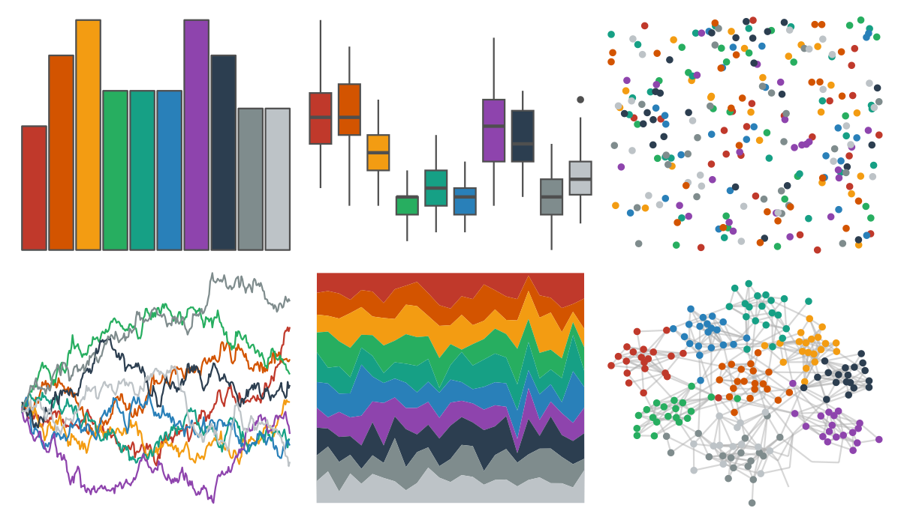
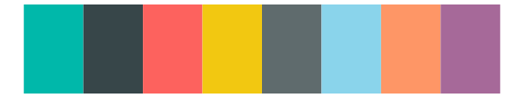

# ggsci - default_flatui 

::: columns
::: {.column width="50%"}

**Github**

[nanxstats/ggsci](https://github.com/nanxstats/ggsci)
:::

::: {.column width="50%"}

**CRAN**

[ggsci](https://CRAN.R-project.org/package=ggsci)
:::
:::

<hr> 

Use with [paletteer](https://emilhvitfeldt.github.io/paletteer/) package:

```r
library(paletteer)
paletteer_d("ggsci::default_flatui")
```

Use raw:

```r
c("#C0392BFF", "#D35400FF", "#F39C12FF", "#27AE60FF", "#16A085FF", "#2980B9FF", "#8E44ADFF", "#2C3E50FF", "#7F8C8DFF", "#BDC3C7FF")
``` 

 

<br>

# Related Palettes

<div class="list" style="display: grid; grid-template-columns: auto auto auto;"> <figure class="figure">
<a href="../../awtools/a_palette/"> </a>
</figure> <figure class="figure">
<a href="../../ButterflyColors/hamadryas_feronia/"> </a>
</figure> <figure class="figure">
<a href="../../ButterflyColors/hamadryas_feronia/"> </a>
</figure> <figure class="figure">
<a href="../../rcartocolor/Bold/"> </a>
</figure> <figure class="figure">
<a href="../../ggsci/hallmarks_light_cosmic/"> </a>
</figure> <figure class="figure">
<a href="../../rcartocolor/Vivid/"> </a>
</figure> <figure class="figure">
<a href="../../Redmonder/qPBI/"> </a>
</figure> <figure class="figure">
<a href="../../rcartocolor/Prism/"> </a>
</figure> <figure class="figure">
<a href="../../palettetown/deoxys/"> </a>
</figure> <figure class="figure">
<a href="../../palettetown/nidorino/"> </a>
</figure> <figure class="figure">
<a href="../../ggsci/default_nejm/"> </a>
</figure> <figure class="figure">
<a href="../../ggsci/default_locuszoom/"> </a>
</figure> 
</div>
