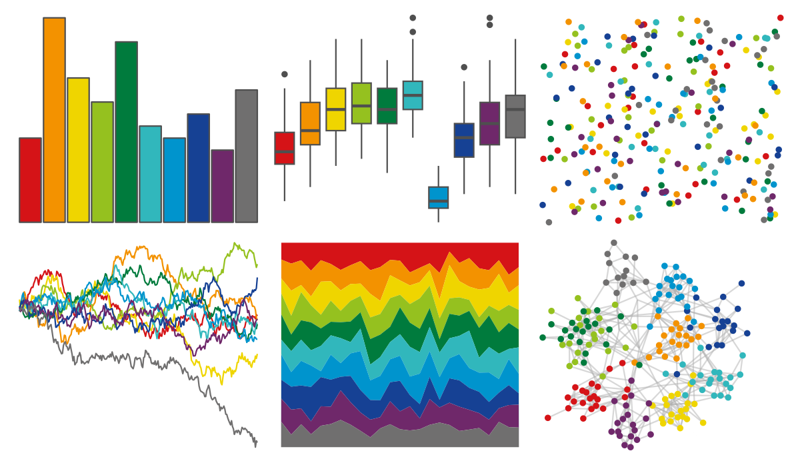

# ggsci - default_frontiers 

::: columns
::: {.column width="50%"}

**Github**

[nanxstats/ggsci](https://github.com/nanxstats/ggsci)
:::

::: {.column width="50%"}

**CRAN**

[ggsci](https://CRAN.R-project.org/package=ggsci)
:::
:::

<hr> 

Use with [paletteer](https://emilhvitfeldt.github.io/paletteer/) package:

```r
library(paletteer)
paletteer_d("ggsci::default_frontiers")
```

Use raw:

```r
c("#D51317FF", "#F39200FF", "#EFD500FF", "#95C11FFF", "#007B3DFF", "#31B7BCFF", "#0094CDFF", "#164194FF", "#6F286AFF", "#706F6FFF")
``` 

 

<br>

# Related Palettes

<div class="list" style="display: grid; grid-template-columns: auto auto auto;"> <figure class="figure">
<a href="../../awtools/a_palette/"> </a>
</figure> <figure class="figure">
<a href="../../ButterflyColors/hamadryas_feronia/"> </a>
</figure> <figure class="figure">
<a href="../../ButterflyColors/hamadryas_feronia/"> </a>
</figure> <figure class="figure">
<a href="../../LaCroixColoR/Mango/"> </a>
</figure> <figure class="figure">
<a href="../../ltc/crbhits/"> </a>
</figure> <figure class="figure">
<a href="../../ggthemr/flat/"> </a>
</figure> <figure class="figure">
<a href="../../LaCroixColoR/Tangerine/"> </a>
</figure> <figure class="figure">
<a href="../../ggthemes/colorblind/"> </a>
</figure> <figure class="figure">
<a href="../../khroma/okabeito/"> </a>
</figure> <figure class="figure">
<a href="../../jcolors/pal5/"> </a>
</figure> <figure class="figure">
<a href="../../colorblindr/OkabeIto/"> </a>
</figure> <figure class="figure">
<a href="../../RColorBrewer/Dark2/"> </a>
</figure> 
</div>
