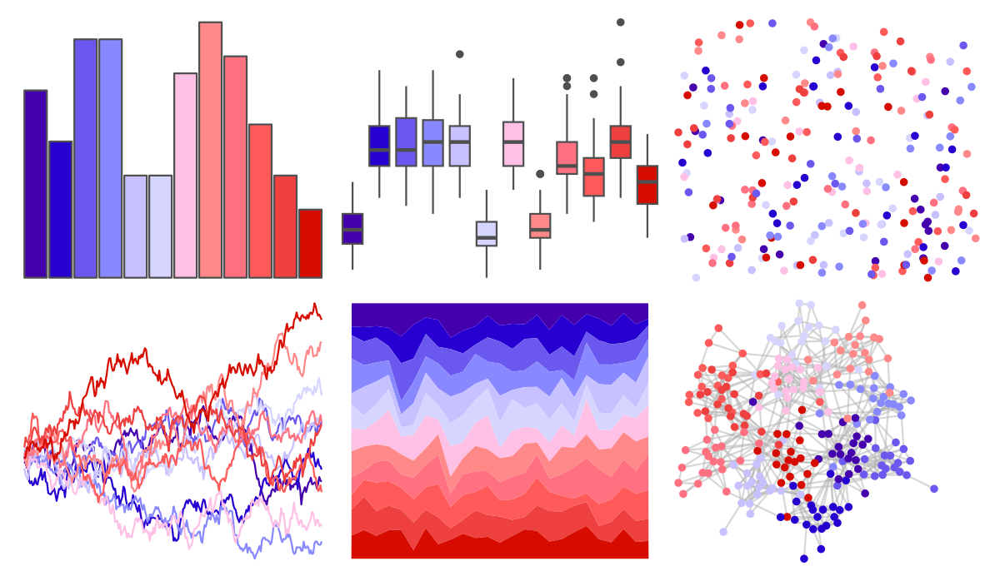

# ggsci - default_gsea 

::: columns
::: {.column width="50%"}

**Github**

[nanxstats/ggsci](https://github.com/nanxstats/ggsci)
:::

::: {.column width="50%"}

**CRAN**

[ggsci](https://CRAN.R-project.org/package=ggsci)
:::
:::

<hr> 

Use with [paletteer](https://emilhvitfeldt.github.io/paletteer/) package:

```r
library(paletteer)
paletteer_d("ggsci::default_gsea")
```

Use raw:

```r
c("#4500ADFF", "#2700D1FF", "#6B58EFFF", "#8888FFFF", "#C7C1FFFF", "#D5D5FFFF", "#FFC0E5FF", "#FF8989FF", "#FF7080FF", "#FF5A5AFF", "#EF4040FF", "#D60C00FF")
``` 

 

<br>

# Related Palettes

<div class="list" style="display: grid; grid-template-columns: auto auto auto;"> <figure class="figure">
<a href="../../amerika/Dem_Ind_Rep3/"> </a>
</figure> <figure class="figure">
<a href="../../RColorBrewer/RdPu/"> </a>
</figure> <figure class="figure">
<a href="../../ggprism/prism_light/"> </a>
</figure> <figure class="figure">
<a href="../../ggprism/prism_dark2/"> </a>
</figure> <figure class="figure">
<a href="../../tvthemes/BluebirdAzurite/"> </a>
</figure> <figure class="figure">
<a href="../../LaCroixColoR/CranRaspberry/"> </a>
</figure> <figure class="figure">
<a href="../../ggprism/prism_light2/"> </a>
</figure> <figure class="figure">
<a href="../../ggprism/prism_dark/"> </a>
</figure> <figure class="figure">
<a href="../../rcartocolor/ag_Sunset/"> </a>
</figure> <figure class="figure">
<a href="../../vapoRwave/avanti/"> </a>
</figure> <figure class="figure">
<a href="../../ggsci/pink_tw3/"> </a>
</figure> <figure class="figure">
<a href="../../ggsci/pink_material/"> </a>
</figure> 
</div>
