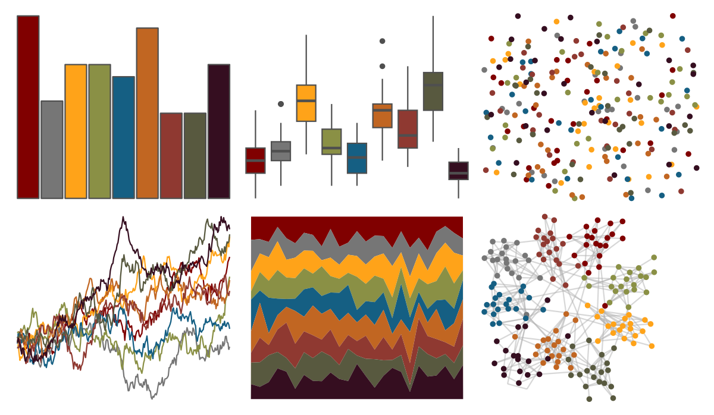

# ggsci - default_uchicago 

::: columns
::: {.column width="50%"}

**Github**

[nanxstats/ggsci](https://github.com/nanxstats/ggsci)
:::

::: {.column width="50%"}

**CRAN**

[ggsci](https://CRAN.R-project.org/package=ggsci)
:::
:::

<hr> 

Use with [paletteer](https://emilhvitfeldt.github.io/paletteer/) package:

```r
library(paletteer)
paletteer_d("ggsci::default_uchicago")
```

Use raw:

```r
c("#800000FF", "#767676FF", "#FFA319FF", "#8A9045FF", "#155F83FF", "#C16622FF", "#8F3931FF", "#58593FFF", "#350E20FF")
``` 

 

<br>

# Related Palettes

<div class="list" style="display: grid; grid-template-columns: auto auto auto;"> <figure class="figure">
<a href="../../amerika/Dem_Ind_Rep3/"> </a>
</figure> <figure class="figure">
<a href="../../ggsci/dark_uchicago/"> </a>
</figure> <figure class="figure">
<a href="../../tvthemes/attackOnTitan/"> </a>
</figure> <figure class="figure">
<a href="../../tvthemes/FireNation/"> </a>
</figure> <figure class="figure">
<a href="../../nbapalettes/suns/"> </a>
</figure> <figure class="figure">
<a href="../../peRReo/badbunny2/"> </a>
</figure> <figure class="figure">
<a href="../../ggsci/default_jco/"> </a>
</figure> <figure class="figure">
<a href="../../ggthemr/grape/"> </a>
</figure> <figure class="figure">
<a href="../../futurevisions/pegasi/"> </a>
</figure> <figure class="figure">
<a href="../../MetBrewer/Redon/"> </a>
</figure> <figure class="figure">
<a href="../../ltc/hat/"> </a>
</figure> <figure class="figure">
<a href="../../ltc/ten_colors/"> </a>
</figure> 
</div>
