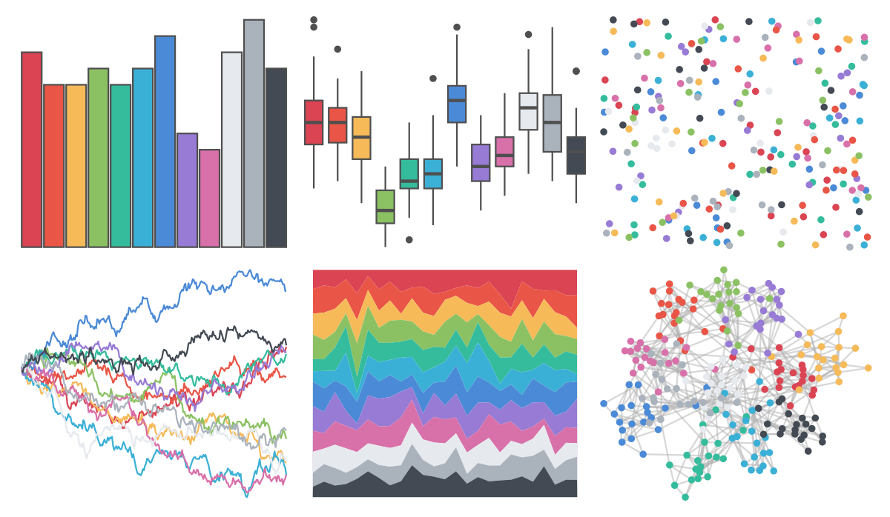

# ggsci - flattastic_flatui 

::: columns
::: {.column width="50%"}

**Github**

[nanxstats/ggsci](https://github.com/nanxstats/ggsci)
:::

::: {.column width="50%"}

**CRAN**

[ggsci](https://CRAN.R-project.org/package=ggsci)
:::
:::

<hr> 

Use with [paletteer](https://emilhvitfeldt.github.io/paletteer/) package:

```r
library(paletteer)
paletteer_d("ggsci::flattastic_flatui")
```

Use raw:

```r
c("#DA4453FF", "#E95546FF", "#F6BA59FF", "#8BC163FF", "#34BC9DFF", "#3BB0D6FF", "#4B8AD6FF", "#977BD5FF", "#D870A9FF", "#E6E9EDFF", "#AAB2BCFF", "#434A53FF")
``` 

 

<br>

# Related Palettes

<div class="list" style="display: grid; grid-template-columns: auto auto auto;"> <figure class="figure">
<a href="../../amerika/Dem_Ind_Rep3/"> </a>
</figure> <figure class="figure">
<a href="../../palettetown/wartortle/"> </a>
</figure> <figure class="figure">
<a href="../../IslamicArt/shiraz2/"> </a>
</figure> <figure class="figure">
<a href="../../palettetown/nidorino/"> </a>
</figure> <figure class="figure">
<a href="../../ggthemes/stata_economist/"> </a>
</figure> <figure class="figure">
<a href="../../ggsci/observable10_observable/"> </a>
</figure> <figure class="figure">
<a href="../../palettetown/nidorina/"> </a>
</figure> <figure class="figure">
<a href="../../palettetown/butterfree/"> </a>
</figure> <figure class="figure">
<a href="../../rcartocolor/Vivid/"> </a>
</figure> <figure class="figure">
<a href="../../palettetown/koffing/"> </a>
</figure> <figure class="figure">
<a href="../../palettetown/kirlia/"> </a>
</figure> <figure class="figure">
<a href="../../Redmonder/qMSO12/"> </a>
</figure> 
</div>
