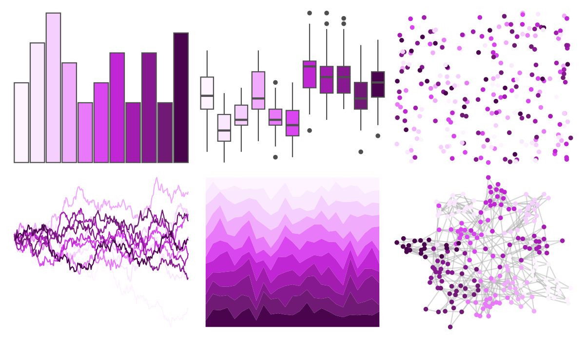

# ggsci - fuchsia_tw3 

::: columns
::: {.column width="50%"}

**Github**

[nanxstats/ggsci](https://github.com/nanxstats/ggsci)
:::

::: {.column width="50%"}

**CRAN**

[ggsci](https://CRAN.R-project.org/package=ggsci)
:::
:::

<hr> 

Use with [paletteer](https://emilhvitfeldt.github.io/paletteer/) package:

```r
library(paletteer)
paletteer_d("ggsci::fuchsia_tw3")
```

Use raw:

```r
c("#FDF4FFFF", "#FAE8FFFF", "#F5D0FEFF", "#F0ABFCFF", "#E879F9FF", "#D946EFFF", "#C026D3FF", "#A21CAFFF", "#86198FFF", "#701A75FF", "#4A044EFF")
``` 

 

<br>

# Related Palettes

<div class="list" style="display: grid; grid-template-columns: auto auto auto;"> <figure class="figure">
<a href="../../amerika/Dem_Ind_Rep3/"> </a>
</figure> <figure class="figure">
<a href="../../ggsci/purple_tw3/"> </a>
</figure> <figure class="figure">
<a href="../../ggsci/purple_material/"> </a>
</figure> <figure class="figure">
<a href="../../ggsci/violet_tw3/"> </a>
</figure> <figure class="figure">
<a href="../../RColorBrewer/RdPu/"> </a>
</figure> <figure class="figure">
<a href="../../tvthemes/Sugilite/"> </a>
</figure> <figure class="figure">
<a href="../../ggsci/pink_tw3/"> </a>
</figure> <figure class="figure">
<a href="../../MoMAColors/Flash/"> </a>
</figure> <figure class="figure">
<a href="../../ggsci/indigo_tw3/"> </a>
</figure> <figure class="figure">
<a href="../../PrettyCols/PurplePinks/"> </a>
</figure> <figure class="figure">
<a href="../../ggsci/indigo_bs5/"> </a>
</figure> <figure class="figure">
<a href="../../tvthemes/RoseQuartz/"> </a>
</figure> 
</div>
