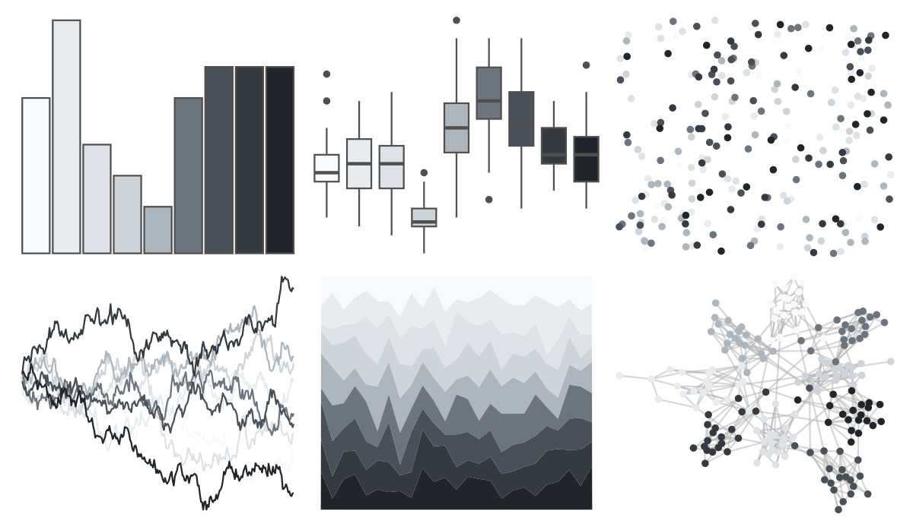

# ggsci - gray_bs5 

::: columns
::: {.column width="50%"}

**Github**

[nanxstats/ggsci](https://github.com/nanxstats/ggsci)
:::

::: {.column width="50%"}

**CRAN**

[ggsci](https://CRAN.R-project.org/package=ggsci)
:::
:::

<hr> 

Use with [paletteer](https://emilhvitfeldt.github.io/paletteer/) package:

```r
library(paletteer)
paletteer_d("ggsci::gray_bs5")
```

Use raw:

```r
c("#F8F9FAFF", "#E9ECEFFF", "#DEE2E6FF", "#CED4DAFF", "#ADB5BDFF", "#6C757DFF", "#495057FF", "#343A40FF", "#212529FF")
``` 

 

<br>

# Related Palettes

<div class="list" style="display: grid; grid-template-columns: auto auto auto;"> <figure class="figure">
<a href="../../amerika/Dem_Ind_Rep3/"> </a>
</figure> <figure class="figure">
<a href="../../Redmonder/sPBIGy1/"> </a>
</figure> <figure class="figure">
<a href="../../Redmonder/sPBIGy2/"> </a>
</figure> <figure class="figure">
<a href="../../palettetown/poliwrath/"> </a>
</figure> <figure class="figure">
<a href="../../ggsci/blue_grey_material/"> </a>
</figure> <figure class="figure">
<a href="../../palettetown/remoraid/"> </a>
</figure> <figure class="figure">
<a href="../../palettetown/grimer/"> </a>
</figure> <figure class="figure">
<a href="../../trekcolors/andorian/"> </a>
</figure> <figure class="figure">
<a href="../../palettetown/poliwhirl/"> </a>
</figure> <figure class="figure">
<a href="../../tayloRswift/midnights/"> </a>
</figure> <figure class="figure">
<a href="../../ggsci/grey_material/"> </a>
</figure> <figure class="figure">
<a href="../../PNWColors/Winter/"> </a>
</figure> 
</div>
