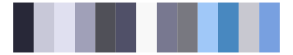

# ggsci - gray_tw3 

::: columns
::: {.column width="50%"}

**Github**

[nanxstats/ggsci](https://github.com/nanxstats/ggsci)
:::

::: {.column width="50%"}

**CRAN**

[ggsci](https://CRAN.R-project.org/package=ggsci)
:::
:::

<hr> 

Use with [paletteer](https://emilhvitfeldt.github.io/paletteer/) package:

```r
library(paletteer)
paletteer_d("ggsci::gray_tw3")
```

Use raw:

```r
c("#F9FAFBFF", "#F3F4F6FF", "#E5E7EBFF", "#D1D5DBFF", "#9CA3AFFF", "#6B7280FF", "#4B5563FF", "#374151FF", "#1F2937FF", "#111827FF", "#030712FF")
``` 

 

<br>

# Related Palettes

<div class="list" style="display: grid; grid-template-columns: auto auto auto;"> <figure class="figure">
<a href="../../amerika/Dem_Ind_Rep3/"> </a>
</figure> <figure class="figure">
<a href="../../ggsci/slate_tw3/"> </a>
</figure> <figure class="figure">
<a href="../../beyonce/X77/"> </a>
</figure> <figure class="figure">
<a href="../../palettetown/barboach/"> </a>
</figure> <figure class="figure">
<a href="../../beyonce/X7/"> </a>
</figure> <figure class="figure">
<a href="../../palettetown/altaria/"> </a>
</figure> <figure class="figure">
<a href="../../palettetown/mantine/"> </a>
</figure> <figure class="figure">
<a href="../../trekcolors/andorian/"> </a>
</figure> <figure class="figure">
<a href="../../palettetown/golbat/"> </a>
</figure> <figure class="figure">
<a href="../../MexBrewer/Maiz/"> </a>
</figure> <figure class="figure">
<a href="../../palettetown/aerodactyl/"> </a>
</figure> <figure class="figure">
<a href="../../palettetown/glalie/"> </a>
</figure> 
</div>
