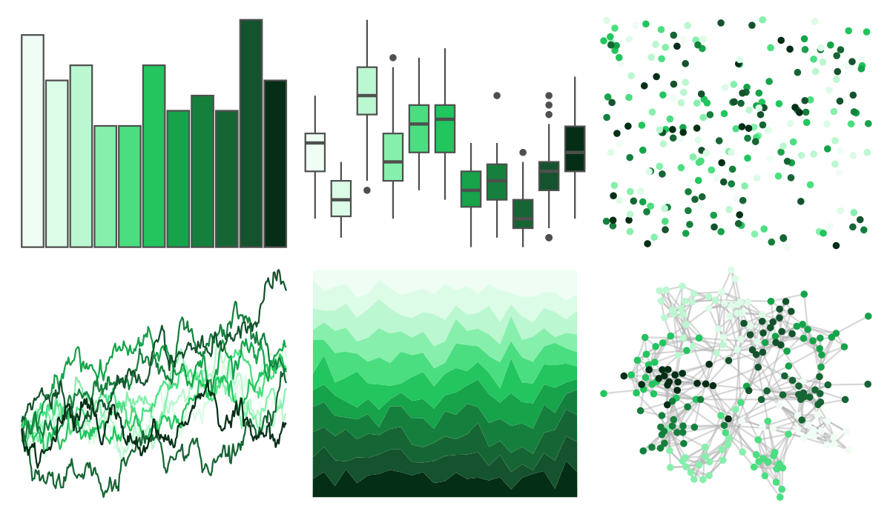

# ggsci - green_tw3 

::: columns
::: {.column width="50%"}

**Github**

[nanxstats/ggsci](https://github.com/nanxstats/ggsci)
:::

::: {.column width="50%"}

**CRAN**

[ggsci](https://CRAN.R-project.org/package=ggsci)
:::
:::

<hr> 

Use with [paletteer](https://emilhvitfeldt.github.io/paletteer/) package:

```r
library(paletteer)
paletteer_d("ggsci::green_tw3")
```

Use raw:

```r
c("#F0FDF4FF", "#DCFCE7FF", "#BBF7D0FF", "#86EFACFF", "#4ADE80FF", "#22C55EFF", "#16A34AFF", "#15803DFF", "#166534FF", "#14532DFF", "#052E16FF")
``` 

 

<br>

# Related Palettes

<div class="list" style="display: grid; grid-template-columns: auto auto auto;"> <figure class="figure">
<a href="../../amerika/Dem_Ind_Rep3/"> </a>
</figure> <figure class="figure">
<a href="../../ggsci/teal_bs5/"> </a>
</figure> <figure class="figure">
<a href="../../ggsci/emerald_tw3/"> </a>
</figure> <figure class="figure">
<a href="../../RColorBrewer/Greens/"> </a>
</figure> <figure class="figure">
<a href="../../RColorBrewer/YlGn/"> </a>
</figure> <figure class="figure">
<a href="../../RColorBrewer/BuGn/"> </a>
</figure> <figure class="figure">
<a href="../../ggsci/green_bs5/"> </a>
</figure> <figure class="figure">
<a href="../../ggsci/teal_tw3/"> </a>
</figure> <figure class="figure">
<a href="../../ggprism/evergreen/"> </a>
</figure> <figure class="figure">
<a href="../../Redmonder/qMSOGnYl/"> </a>
</figure> <figure class="figure">
<a href="../../ggsci/green_material/"> </a>
</figure> <figure class="figure">
<a href="../../MetBrewer/VanGogh3/"> </a>
</figure> 
</div>
