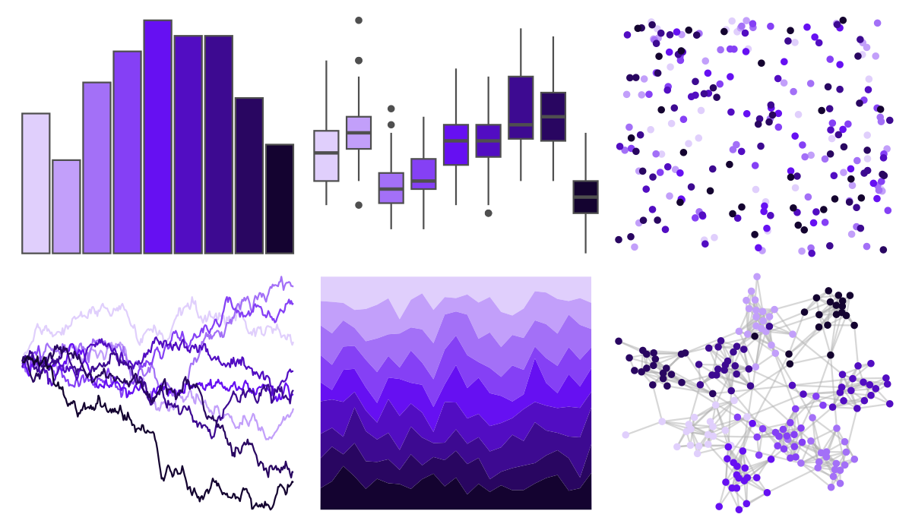

# ggsci - indigo_bs5 

::: columns
::: {.column width="50%"}

**Github**

[nanxstats/ggsci](https://github.com/nanxstats/ggsci)
:::

::: {.column width="50%"}

**CRAN**

[ggsci](https://CRAN.R-project.org/package=ggsci)
:::
:::

<hr> 

Use with [paletteer](https://emilhvitfeldt.github.io/paletteer/) package:

```r
library(paletteer)
paletteer_d("ggsci::indigo_bs5")
```

Use raw:

```r
c("#E0CFFCFF", "#C29FFAFF", "#A370F7FF", "#8540F5FF", "#6610F2FF", "#520DC2FF", "#3D0A91FF", "#290661FF", "#140330FF")
``` 

 

<br>

# Related Palettes

<div class="list" style="display: grid; grid-template-columns: auto auto auto;"> <figure class="figure">
<a href="../../amerika/Dem_Ind_Rep3/"> </a>
</figure> <figure class="figure">
<a href="../../tvthemes/Sugilite/"> </a>
</figure> <figure class="figure">
<a href="../../ggprism/the_blues/"> </a>
</figure> <figure class="figure">
<a href="../../ggsci/purple_tw3/"> </a>
</figure> <figure class="figure">
<a href="../../ggsci/violet_tw3/"> </a>
</figure> <figure class="figure">
<a href="../../ggprism/winter_bright/"> </a>
</figure> <figure class="figure">
<a href="../../ggsci/purple_bs5/"> </a>
</figure> <figure class="figure">
<a href="../../ggsci/blue_bs5/"> </a>
</figure> <figure class="figure">
<a href="../../ggsci/fuchsia_tw3/"> </a>
</figure> <figure class="figure">
<a href="../../ggsci/indigo_tw3/"> </a>
</figure> <figure class="figure">
<a href="../../ggsci/purple_material/"> </a>
</figure> <figure class="figure">
<a href="../../ggsci/deep_purple_material/"> </a>
</figure> 
</div>
