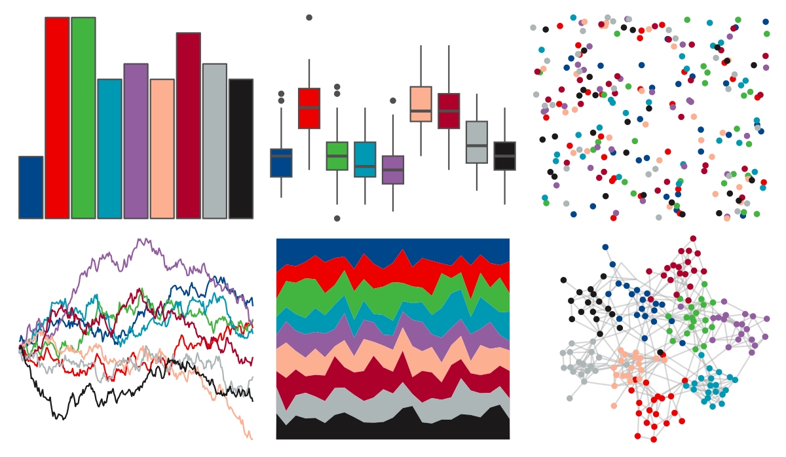

# ggsci - lanonc_lancet 

::: columns
::: {.column width="50%"}

**Github**

[nanxstats/ggsci](https://github.com/nanxstats/ggsci)
:::

::: {.column width="50%"}

**CRAN**

[ggsci](https://CRAN.R-project.org/package=ggsci)
:::
:::

<hr> 

Use with [paletteer](https://emilhvitfeldt.github.io/paletteer/) package:

```r
library(paletteer)
paletteer_d("ggsci::lanonc_lancet")
```

Use raw:

```r
c("#00468BFF", "#ED0000FF", "#42B540FF", "#0099B4FF", "#925E9FFF", "#FDAF91FF", "#AD002AFF", "#ADB6B6FF", "#1B1919FF")
``` 

 

<br>

# Related Palettes

<div class="list" style="display: grid; grid-template-columns: auto auto auto;"> <figure class="figure">
<a href="../../awtools/a_palette/"> </a>
</figure> <figure class="figure">
<a href="../../peRReo/karolg/"> </a>
</figure> <figure class="figure">
<a href="../../rcartocolor/Safe/"> </a>
</figure> <figure class="figure">
<a href="../../ggsci/planetexpress_futurama/"> </a>
</figure> <figure class="figure">
<a href="../../trekcolors/gorn/"> </a>
</figure> <figure class="figure">
<a href="../../nbapalettes/suns/"> </a>
</figure> <figure class="figure">
<a href="../../tvthemes/Bismuth/"> </a>
</figure> <figure class="figure">
<a href="../../tvthemes/attackOnTitan/"> </a>
</figure> <figure class="figure">
<a href="../../unikn/pal_unikn_pref/"> </a>
</figure> <figure class="figure">
<a href="../../jcolors/pal6/"> </a>
</figure> <figure class="figure">
<a href="../../ggprism/floral2/"> </a>
</figure> <figure class="figure">
<a href="../../palettetown/nosepass/"> </a>
</figure> 
</div>
