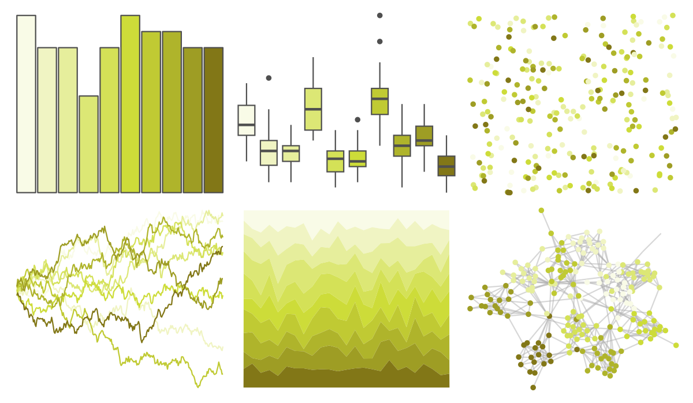

# ggsci - lime_material 

::: columns
::: {.column width="50%"}

**Github**

[nanxstats/ggsci](https://github.com/nanxstats/ggsci)
:::

::: {.column width="50%"}

**CRAN**

[ggsci](https://CRAN.R-project.org/package=ggsci)
:::
:::

<hr> 

Use with [paletteer](https://emilhvitfeldt.github.io/paletteer/) package:

```r
library(paletteer)
paletteer_d("ggsci::lime_material")
```

Use raw:

```r
c("#F9FBE7FF", "#F0F4C3FF", "#E6EE9CFF", "#DCE775FF", "#D4E157FF", "#CDDC39FF", "#C0CA33FF", "#AFB42BFF", "#9E9D24FF", "#827717FF")
``` 

 

<br>

# Related Palettes

<div class="list" style="display: grid; grid-template-columns: auto auto auto;"> <figure class="figure">
<a href="../../amerika/Dem_Ind_Rep3/"> </a>
</figure> <figure class="figure">
<a href="../../ggsci/light_green_material/"> </a>
</figure> <figure class="figure">
<a href="../../PrettyCols/Yellows/"> </a>
</figure> <figure class="figure">
<a href="../../fishualize/Prognathodes_brasiliensis/"> </a>
</figure> <figure class="figure">
<a href="../../Redmonder/sPBIYl/"> </a>
</figure> <figure class="figure">
<a href="../../palettetown/metapod/"> </a>
</figure> <figure class="figure">
<a href="../../ggprism/mustard_field/"> </a>
</figure> <figure class="figure">
<a href="../../waRhol/skull_76_1/"> </a>
</figure> <figure class="figure">
<a href="../../ggsci/lime_tw3/"> </a>
</figure> <figure class="figure">
<a href="../../ggsci/yellow_material/"> </a>
</figure> <figure class="figure">
<a href="../../ggprism/mustard_field2/"> </a>
</figure> <figure class="figure">
<a href="../../palettetown/cacturne/"> </a>
</figure> 
</div>
