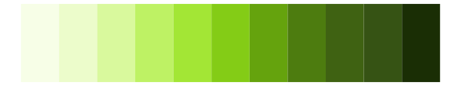

# ggsci - lime_tw3 

::: columns
::: {.column width="50%"}

**Github**

[nanxstats/ggsci](https://github.com/nanxstats/ggsci)
:::

::: {.column width="50%"}

**CRAN**

[ggsci](https://CRAN.R-project.org/package=ggsci)
:::
:::

<hr> 

Use with [paletteer](https://emilhvitfeldt.github.io/paletteer/) package:

```r
library(paletteer)
paletteer_d("ggsci::lime_tw3")
```

Use raw:

```r
c("#F7FEE7FF", "#ECFCCBFF", "#D9F99DFF", "#BEF264FF", "#A3E635FF", "#84CC16FF", "#65A30DFF", "#4D7C0FFF", "#3F6212FF", "#365314FF", "#1A2E05FF")
``` 

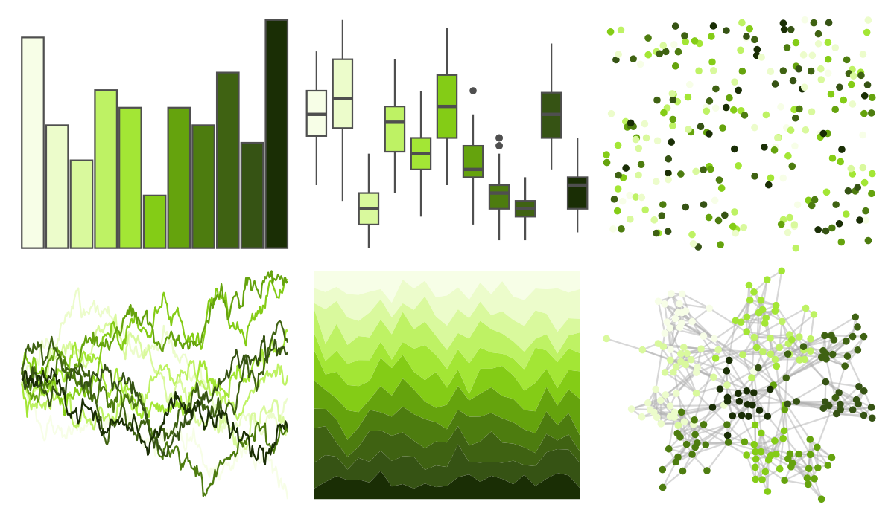 

<br>

# Related Palettes

<div class="list" style="display: grid; grid-template-columns: auto auto auto;"> <figure class="figure">
<a href="../../amerika/Dem_Ind_Rep3/"> </a>
</figure> <figure class="figure">
<a href="../../tvthemes/Peridot/"> 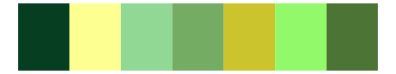</a>
</figure> <figure class="figure">
<a href="../../RColorBrewer/YlGn/"> 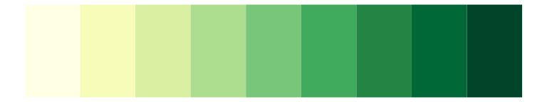</a>
</figure> <figure class="figure">
<a href="../../ggsci/light_green_material/"> 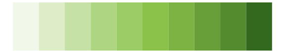</a>
</figure> <figure class="figure">
<a href="../../palettetown/cacturne/"> 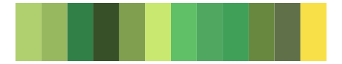</a>
</figure> <figure class="figure">
<a href="../../ggsci/lime_material/"> 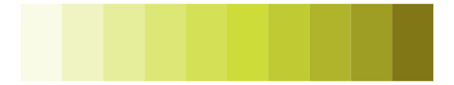</a>
</figure> <figure class="figure">
<a href="../../RColorBrewer/Greens/"> 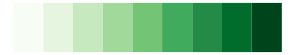</a>
</figure> <figure class="figure">
<a href="../../palettetown/metapod/"> </a>
</figure> <figure class="figure">
<a href="../../ggsci/green_tw3/"> 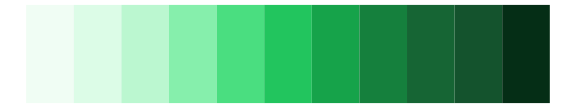</a>
</figure> <figure class="figure">
<a href="../../MoMAColors/Alkalay2/"> 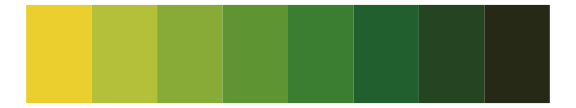</a>
</figure> <figure class="figure">
<a href="../../ggsci/green_material/"> 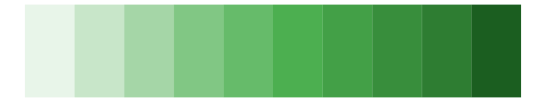</a>
</figure> <figure class="figure">
<a href="../../tvthemes/EarthKingdom/"> </a>
</figure> 
</div>
