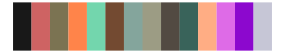

# ggsci - mark17_primer 

::: columns
::: {.column width="50%"}

**Github**

[nanxstats/ggsci](https://github.com/nanxstats/ggsci)
:::

::: {.column width="50%"}

**CRAN**

[ggsci](https://CRAN.R-project.org/package=ggsci)
:::
:::

<hr> 

Use with [paletteer](https://emilhvitfeldt.github.io/paletteer/) package:

```r
library(paletteer)
paletteer_d("ggsci::mark17_primer")
```

Use raw:

```r
c("#006EDBFF", "#EB670FFF", "#DF0C24FF", "#179B9BFF", "#30A147FF", "#894CEBFF", "#B88700FF", "#CE2C85FF", "#856D4CFF", "#527A29FF", "#D43511FF", "#167E53FF", "#9D615CFF", "#64762DFF", "#A830E8FF", "#866E04FF", "#808FA3FF")
``` 

 

<br>

# Related Palettes

<div class="list" style="display: grid; grid-template-columns: auto auto auto;"> <figure class="figure">
<a href="../../amerika/Dem_Ind_Rep3/"> </a>
</figure> <figure class="figure">
<a href="../../rcartocolor/Vivid/"> </a>
</figure> <figure class="figure">
<a href="../../rcartocolor/Bold/"> </a>
</figure> <figure class="figure">
<a href="../../rcartocolor/Prism/"> </a>
</figure> <figure class="figure">
<a href="../../awtools/bpalette/"> </a>
</figure> <figure class="figure">
<a href="../../MetBrewer/Signac/"> </a>
</figure> <figure class="figure">
<a href="../../ggthemes/Classic_Cyclic/"> </a>
</figure> <figure class="figure">
<a href="../../DresdenColor/paired/"> </a>
</figure> <figure class="figure">
<a href="../../yarrr/info2/"> </a>
</figure> <figure class="figure">
<a href="../../MoMAColors/Klein/"> </a>
</figure> <figure class="figure">
<a href="../../palettetown/deoxys/"> </a>
</figure> <figure class="figure">
<a href="../../miscpalettes/brightPastel/"> </a>
</figure> 
</div>
