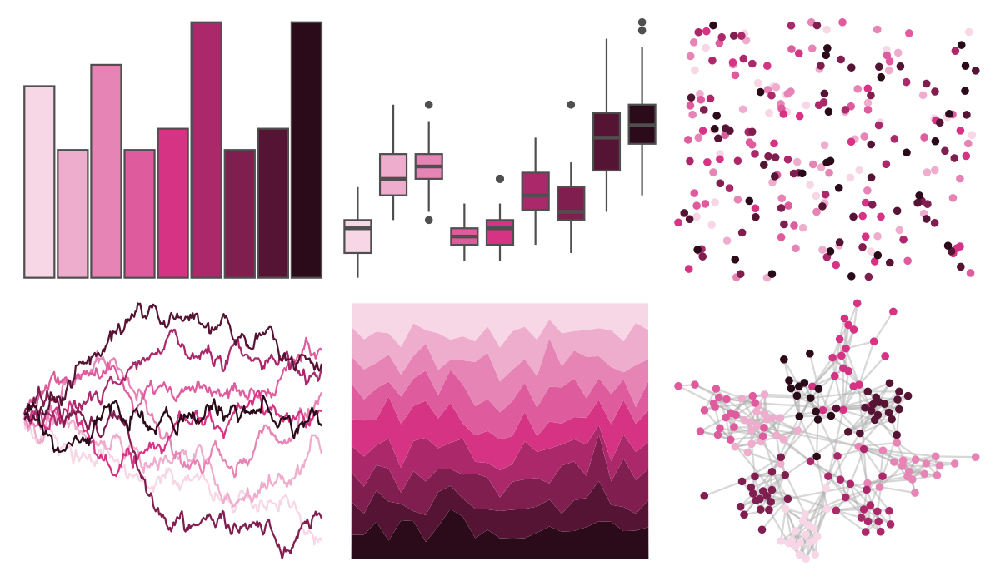

# ggsci - pink_bs5 

::: columns
::: {.column width="50%"}

**Github**

[nanxstats/ggsci](https://github.com/nanxstats/ggsci)
:::

::: {.column width="50%"}

**CRAN**

[ggsci](https://CRAN.R-project.org/package=ggsci)
:::
:::

<hr> 

Use with [paletteer](https://emilhvitfeldt.github.io/paletteer/) package:

```r
library(paletteer)
paletteer_d("ggsci::pink_bs5")
```

Use raw:

```r
c("#F7D6E6FF", "#EFADCEFF", "#E685B5FF", "#DE5C9DFF", "#D63384FF", "#AB296AFF", "#801F4FFF", "#561435FF", "#2B0A1AFF")
``` 

 

<br>

# Related Palettes

<div class="list" style="display: grid; grid-template-columns: auto auto auto;"> <figure class="figure">
<a href="../../amerika/Dem_Ind_Rep3/"> </a>
</figure> <figure class="figure">
<a href="../../ggsci/pink_tw3/"> </a>
</figure> <figure class="figure">
<a href="../../ggsci/red_bs5/"> </a>
</figure> <figure class="figure">
<a href="../../tvthemes/Rhodonite/"> </a>
</figure> <figure class="figure">
<a href="../../ggsci/pink_material/"> </a>
</figure> <figure class="figure">
<a href="../../rcartocolor/Magenta/"> </a>
</figure> <figure class="figure">
<a href="../../MoMAColors/Flash/"> </a>
</figure> <figure class="figure">
<a href="../../beyonce/X27/"> </a>
</figure> <figure class="figure">
<a href="../../palettetown/ditto/"> </a>
</figure> <figure class="figure">
<a href="../../beyonce/X14/"> </a>
</figure> <figure class="figure">
<a href="../../NatParksPalettes/Arches2/"> </a>
</figure> <figure class="figure">
<a href="../../rcartocolor/Burg/"> </a>
</figure> 
</div>
