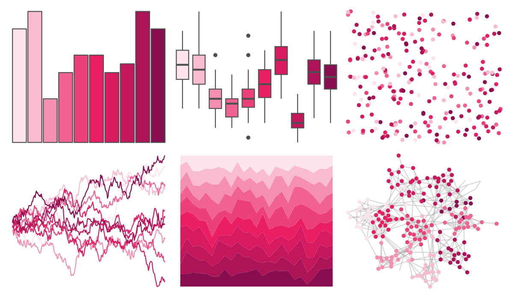
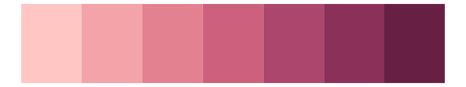
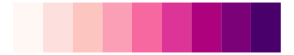

# ggsci - pink_material 

::: columns
::: {.column width="50%"}

**Github**

[nanxstats/ggsci](https://github.com/nanxstats/ggsci)
:::

::: {.column width="50%"}

**CRAN**

[ggsci](https://CRAN.R-project.org/package=ggsci)
:::
:::

<hr> 

Use with [paletteer](https://emilhvitfeldt.github.io/paletteer/) package:

```r
library(paletteer)
paletteer_d("ggsci::pink_material")
```

Use raw:

```r
c("#FCE4ECFF", "#F8BBD0FF", "#F48FB1FF", "#F06292FF", "#EC407AFF", "#E91E63FF", "#D81B60FF", "#C2185BFF", "#AD1457FF", "#880E4FFF")
``` 

 

<br>

# Related Palettes

<div class="list" style="display: grid; grid-template-columns: auto auto auto;"> <figure class="figure">
<a href="../../awtools/a_palette/"> </a>
</figure> <figure class="figure">
<a href="../../rcartocolor/Burg/"> </a>
</figure> <figure class="figure">
<a href="../../rcartocolor/Magenta/"> </a>
</figure> <figure class="figure">
<a href="../../vapeplot/sunset/"> </a>
</figure> <figure class="figure">
<a href="../../vapoRwave/sunSet/"> </a>
</figure> <figure class="figure">
<a href="../../unikn/pal_bordeaux/"> </a>
</figure> <figure class="figure">
<a href="../../RColorBrewer/PuRd/"> </a>
</figure> <figure class="figure">
<a href="../../unikn/pal_pinky/"> </a>
</figure> <figure class="figure">
<a href="../../RColorBrewer/RdPu/"> </a>
</figure> <figure class="figure">
<a href="../../ggthemes/excel_Ion_Boardroom/"> </a>
</figure> <figure class="figure">
<a href="../../beyonce/X27/"> </a>
</figure> <figure class="figure">
<a href="../../rcartocolor/SunsetDark/"> </a>
</figure> 
</div>
