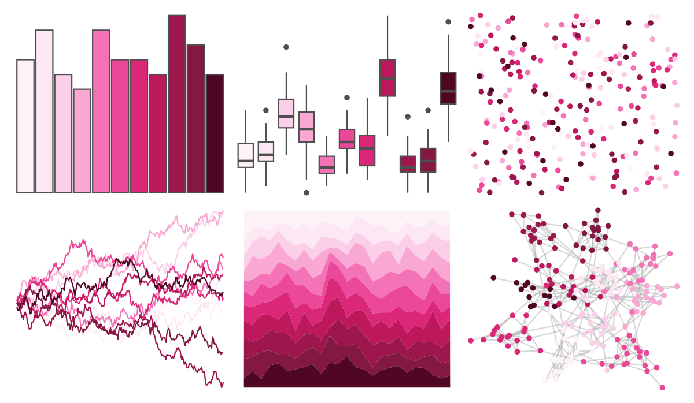

# ggsci - pink_tw3 

::: columns
::: {.column width="50%"}

**Github**

[nanxstats/ggsci](https://github.com/nanxstats/ggsci)
:::

::: {.column width="50%"}

**CRAN**

[ggsci](https://CRAN.R-project.org/package=ggsci)
:::
:::

<hr> 

Use with [paletteer](https://emilhvitfeldt.github.io/paletteer/) package:

```r
library(paletteer)
paletteer_d("ggsci::pink_tw3")
```

Use raw:

```r
c("#FDF2F8FF", "#FCE7F3FF", "#FBCFE8FF", "#F9A8D4FF", "#F472B6FF", "#EC4899FF", "#DB2777FF", "#BE185DFF", "#9D174DFF", "#831843FF", "#500724FF")
``` 

 

<br>

# Related Palettes

<div class="list" style="display: grid; grid-template-columns: auto auto auto;"> <figure class="figure">
<a href="../../amerika/Dem_Ind_Rep3/"> </a>
</figure> <figure class="figure">
<a href="../../ggsci/rose_tw3/"> </a>
</figure> <figure class="figure">
<a href="../../ggsci/pink_material/"> </a>
</figure> <figure class="figure">
<a href="../../RColorBrewer/PuRd/"> </a>
</figure> <figure class="figure">
<a href="../../RColorBrewer/RdPu/"> </a>
</figure> <figure class="figure">
<a href="../../ggsci/pink_bs5/"> </a>
</figure> <figure class="figure">
<a href="../../rcartocolor/Burg/"> </a>
</figure> <figure class="figure">
<a href="../../ggsci/red_bs5/"> </a>
</figure> <figure class="figure">
<a href="../../ggsci/fuchsia_tw3/"> </a>
</figure> <figure class="figure">
<a href="../../rcartocolor/Magenta/"> </a>
</figure> <figure class="figure">
<a href="../../ggsci/red_tw3/"> </a>
</figure> <figure class="figure">
<a href="../../tvthemes/Sardonyx/"> </a>
</figure> 
</div>
