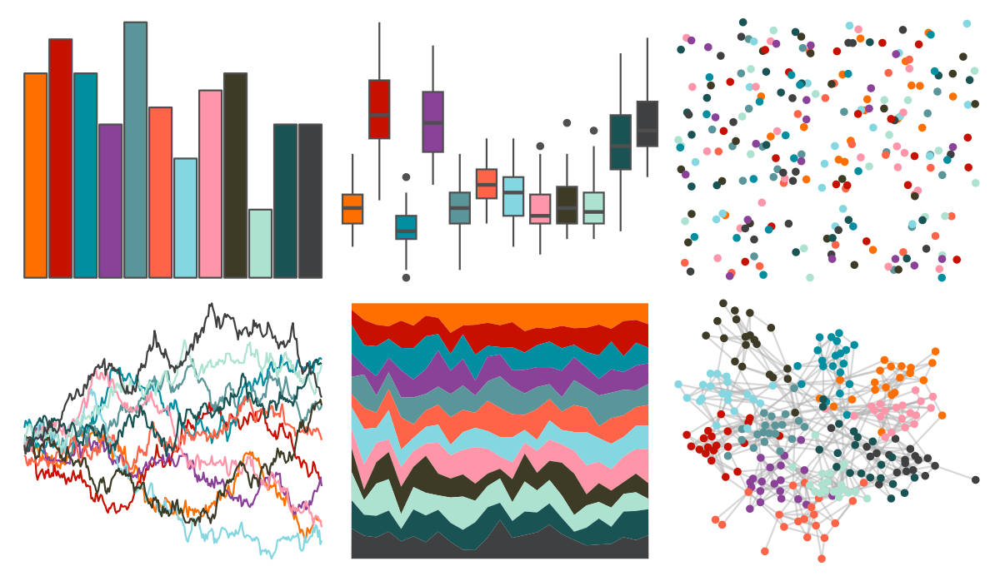
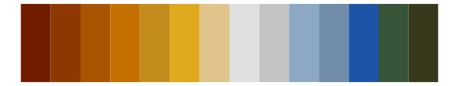

# ggsci - planetexpress_futurama 

::: columns
::: {.column width="50%"}

**Github**

[nanxstats/ggsci](https://github.com/nanxstats/ggsci)
:::

::: {.column width="50%"}

**CRAN**

[ggsci](https://CRAN.R-project.org/package=ggsci)
:::
:::

<hr> 

Use with [paletteer](https://emilhvitfeldt.github.io/paletteer/) package:

```r
library(paletteer)
paletteer_d("ggsci::planetexpress_futurama")
```

Use raw:

```r
c("#FF6F00FF", "#C71000FF", "#008EA0FF", "#8A4198FF", "#5A9599FF", "#FF6348FF", "#84D7E1FF", "#FF95A8FF", "#3D3B25FF", "#ADE2D0FF", "#1A5354FF", "#3F4041FF")
``` 

 

<br>

# Related Palettes

<div class="list" style="display: grid; grid-template-columns: auto auto auto;"> <figure class="figure">
<a href="../../awtools/a_palette/"> </a>
</figure> <figure class="figure">
<a href="../../palettetown/nosepass/"> </a>
</figure> <figure class="figure">
<a href="../../peRReo/karolg/"> </a>
</figure> <figure class="figure">
<a href="../../miscpalettes/dreaming/"> </a>
</figure> <figure class="figure">
<a href="../../ggsci/nrc_npg/"> </a>
</figure> <figure class="figure">
<a href="../../ggsci/lanonc_lancet/"> </a>
</figure> <figure class="figure">
<a href="../../palettetown/porygon/"> </a>
</figure> <figure class="figure">
<a href="../../palettetown/marill/"> </a>
</figure> <figure class="figure">
<a href="../../ggthemr/light/"> </a>
</figure> <figure class="figure">
<a href="../../palettetown/masquerain/"> </a>
</figure> <figure class="figure">
<a href="../../palettetown/porygon2/"> </a>
</figure> <figure class="figure">
<a href="../../ochRe/olsen_seq/"> </a>
</figure> 
</div>
