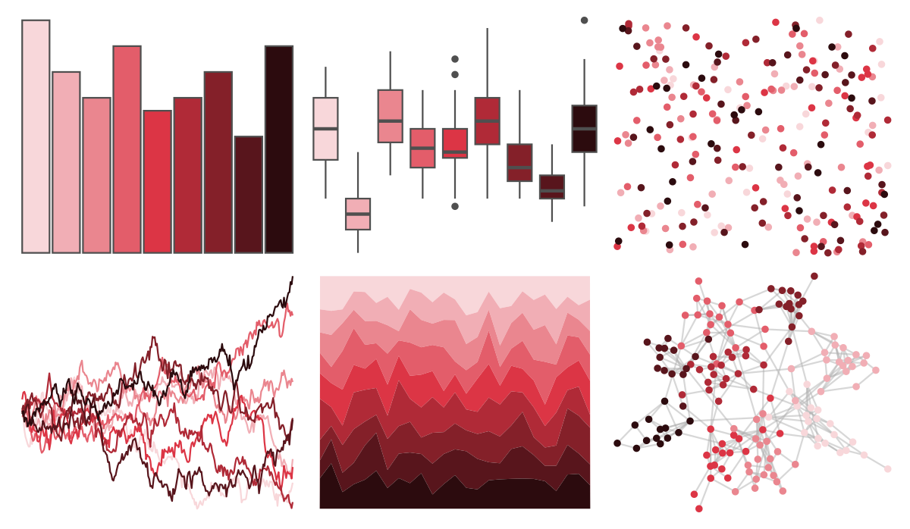

# ggsci - red_bs5 

::: columns
::: {.column width="50%"}

**Github**

[nanxstats/ggsci](https://github.com/nanxstats/ggsci)
:::

::: {.column width="50%"}

**CRAN**

[ggsci](https://CRAN.R-project.org/package=ggsci)
:::
:::

<hr> 

Use with [paletteer](https://emilhvitfeldt.github.io/paletteer/) package:

```r
library(paletteer)
paletteer_d("ggsci::red_bs5")
```

Use raw:

```r
c("#F8D7DAFF", "#F1AEB5FF", "#EA868FFF", "#E35D6AFF", "#DC3545FF", "#B02A37FF", "#842029FF", "#58151CFF", "#2C0B0EFF")
``` 

 

<br>

# Related Palettes

<div class="list" style="display: grid; grid-template-columns: auto auto auto;"> <figure class="figure">
<a href="../../amerika/Dem_Ind_Rep3/"> </a>
</figure> <figure class="figure">
<a href="../../ggsci/rose_tw3/"> </a>
</figure> <figure class="figure">
<a href="../../ggsci/pink_bs5/"> </a>
</figure> <figure class="figure">
<a href="../../palettetown/mew/"> </a>
</figure> <figure class="figure">
<a href="../../ggsci/pink_tw3/"> </a>
</figure> <figure class="figure">
<a href="../../calecopal/vermillion/"> </a>
</figure> <figure class="figure">
<a href="../../ggsci/red_tw3/"> </a>
</figure> <figure class="figure">
<a href="../../ggsci/pink_material/"> </a>
</figure> <figure class="figure">
<a href="../../rcartocolor/Burg/"> </a>
</figure> <figure class="figure">
<a href="../../peRReo/ivyqueen/"> </a>
</figure> <figure class="figure">
<a href="../../MoMAColors/Althoff/"> </a>
</figure> <figure class="figure">
<a href="../../beyonce/X26/"> </a>
</figure> 
</div>
