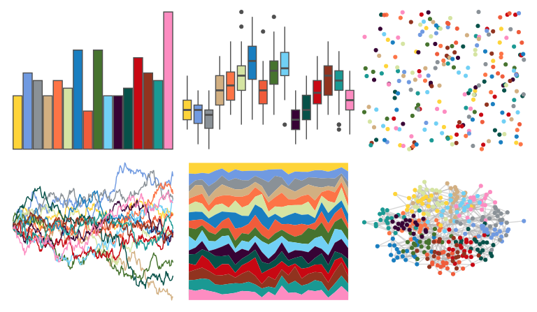

# ggsci - springfield_simpsons 

::: columns
::: {.column width="50%"}

**Github**

[nanxstats/ggsci](https://github.com/nanxstats/ggsci)
:::

::: {.column width="50%"}

**CRAN**

[ggsci](https://CRAN.R-project.org/package=ggsci)
:::
:::

<hr> 

Use with [paletteer](https://emilhvitfeldt.github.io/paletteer/) package:

```r
library(paletteer)
paletteer_d("ggsci::springfield_simpsons")
```

Use raw:

```r
c("#FED439FF", "#709AE1FF", "#8A9197FF", "#D2AF81FF", "#FD7446FF", "#D5E4A2FF", "#197EC0FF", "#F05C3BFF", "#46732EFF", "#71D0F5FF", "#370335FF", "#075149FF", "#C80813FF", "#91331FFF", "#1A9993FF", "#FD8CC1FF")
``` 

 

<br>

# Related Palettes

<div class="list" style="display: grid; grid-template-columns: auto auto auto;"> <figure class="figure">
<a href="../../awtools/a_palette/"> </a>
</figure> <figure class="figure">
<a href="../../IslamicArt/shiraz/"> </a>
</figure> <figure class="figure">
<a href="../../werpals/benagil/"> </a>
</figure> <figure class="figure">
<a href="../../tvthemes/gravityFalls/"> </a>
</figure> <figure class="figure">
<a href="../../ggthemr/sea/"> </a>
</figure> <figure class="figure">
<a href="../../palettetown/masquerain/"> </a>
</figure> <figure class="figure">
<a href="../../palettetown/exploud/"> </a>
</figure> <figure class="figure">
<a href="../../miscpalettes/brightPastel/"> </a>
</figure> <figure class="figure">
<a href="../../palettetown/minun/"> </a>
</figure> <figure class="figure">
<a href="../../MetBrewer/Signac/"> </a>
</figure> <figure class="figure">
<a href="../../palettetown/ariados/"> </a>
</figure> <figure class="figure">
<a href="../../palettetown/jynx/"> </a>
</figure> 
</div>
