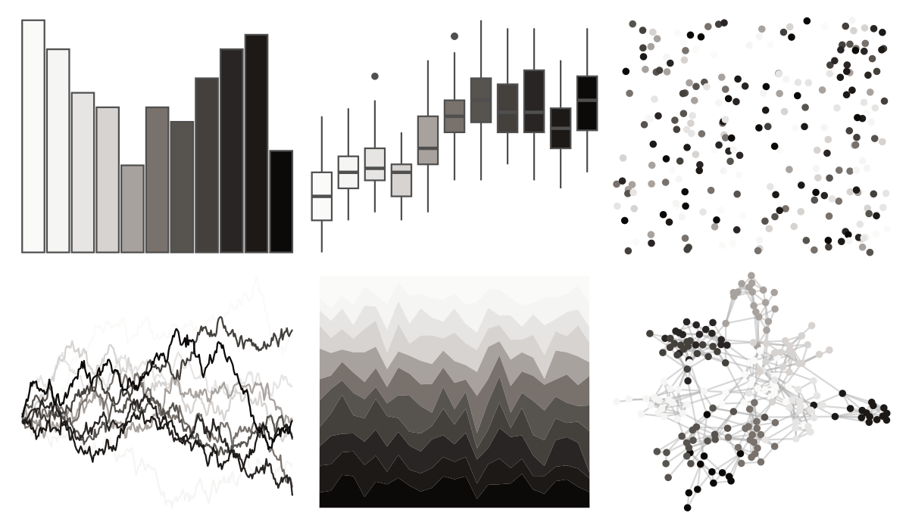

# ggsci - stone_tw3 

::: columns
::: {.column width="50%"}

**Github**

[nanxstats/ggsci](https://github.com/nanxstats/ggsci)
:::

::: {.column width="50%"}

**CRAN**

[ggsci](https://CRAN.R-project.org/package=ggsci)
:::
:::

<hr> 

Use with [paletteer](https://emilhvitfeldt.github.io/paletteer/) package:

```r
library(paletteer)
paletteer_d("ggsci::stone_tw3")
```

Use raw:

```r
c("#FAFAF9FF", "#F5F5F4FF", "#E7E5E4FF", "#D6D3D1FF", "#A8A29EFF", "#78716CFF", "#57534EFF", "#44403CFF", "#292524FF", "#1C1917FF", "#0C0A09FF")
``` 

 

<br>

# Related Palettes

<div class="list" style="display: grid; grid-template-columns: auto auto auto;"> <figure class="figure">
<a href="../../amerika/Dem_Ind_Rep3/"> </a>
</figure> <figure class="figure">
<a href="../../ggsci/neutral_tw3/"> </a>
</figure> <figure class="figure">
<a href="../../ggsci/zinc_tw3/"> </a>
</figure> <figure class="figure">
<a href="../../palettetown/silcoon/"> </a>
</figure> <figure class="figure">
<a href="../../RColorBrewer/Greys/"> </a>
</figure> <figure class="figure">
<a href="../../tayloRswift/reputation/"> </a>
</figure> <figure class="figure">
<a href="../../ggthemes/stata_mono/"> </a>
</figure> <figure class="figure">
<a href="../../ggprism/black_and_white/"> </a>
</figure> <figure class="figure">
<a href="../../ggthemr/greyscale/"> </a>
</figure> <figure class="figure">
<a href="../../tayloRswift/TSTTPD/"> </a>
</figure> <figure class="figure">
<a href="../../palettetown/castform/"> </a>
</figure> <figure class="figure">
<a href="../../trekcolors/borg/"> </a>
</figure> 
</div>
