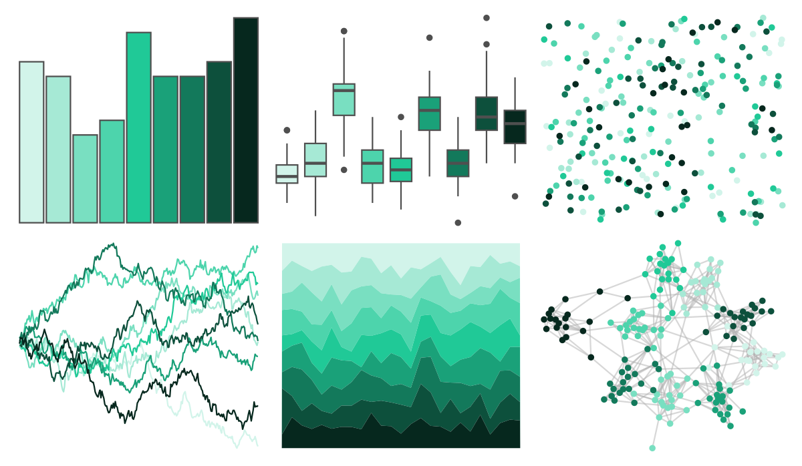

# ggsci - teal_bs5 

::: columns
::: {.column width="50%"}

**Github**

[nanxstats/ggsci](https://github.com/nanxstats/ggsci)
:::

::: {.column width="50%"}

**CRAN**

[ggsci](https://CRAN.R-project.org/package=ggsci)
:::
:::

<hr> 

Use with [paletteer](https://emilhvitfeldt.github.io/paletteer/) package:

```r
library(paletteer)
paletteer_d("ggsci::teal_bs5")
```

Use raw:

```r
c("#D2F4EAFF", "#A6E9D5FF", "#79DFC1FF", "#4DD4ACFF", "#20C997FF", "#1AA179FF", "#13795BFF", "#0D503CFF", "#06281EFF")
``` 

 

<br>

# Related Palettes

<div class="list" style="display: grid; grid-template-columns: auto auto auto;"> <figure class="figure">
<a href="../../amerika/Dem_Ind_Rep3/"> </a>
</figure> <figure class="figure">
<a href="../../ggsci/emerald_tw3/"> </a>
</figure> <figure class="figure">
<a href="../../ggsci/green_bs5/"> </a>
</figure> <figure class="figure">
<a href="../../ggsci/green_tw3/"> </a>
</figure> <figure class="figure">
<a href="../../ggsci/teal_tw3/"> </a>
</figure> <figure class="figure">
<a href="../../RColorBrewer/BuGn/"> </a>
</figure> <figure class="figure">
<a href="../../ggsci/teal_material/"> </a>
</figure> <figure class="figure">
<a href="../../Redmonder/qMSOBu/"> </a>
</figure> <figure class="figure">
<a href="../../fishualize/Parablennius_pilicornis/"> </a>
</figure> <figure class="figure">
<a href="../../rcartocolor/Emrld/"> </a>
</figure> <figure class="figure">
<a href="../../PNWColors/Lake/"> </a>
</figure> <figure class="figure">
<a href="../../ggsci/cyan_material/"> </a>
</figure> 
</div>
