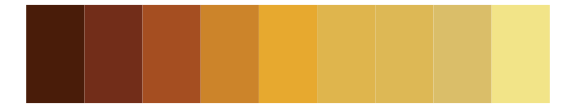

# ggsci - yellow_tw3 

::: columns
::: {.column width="50%"}

**Github**

[nanxstats/ggsci](https://github.com/nanxstats/ggsci)
:::

::: {.column width="50%"}

**CRAN**

[ggsci](https://CRAN.R-project.org/package=ggsci)
:::
:::

<hr> 

Use with [paletteer](https://emilhvitfeldt.github.io/paletteer/) package:

```r
library(paletteer)
paletteer_d("ggsci::yellow_tw3")
```

Use raw:

```r
c("#FEFCE8FF", "#FEF9C3FF", "#FEF08AFF", "#FDE047FF", "#FACC15FF", "#EAB308FF", "#CA8A04FF", "#A16207FF", "#854D0EFF", "#713F12FF", "#422006FF")
``` 

 

<br>

# Related Palettes

<div class="list" style="display: grid; grid-template-columns: auto auto auto;"> <figure class="figure">
<a href="../../amerika/Dem_Ind_Rep3/"> </a>
</figure> <figure class="figure">
<a href="../../ggsci/amber_tw3/"> </a>
</figure> <figure class="figure">
<a href="../../ggsci/yellow_bs5/"> </a>
</figure> <figure class="figure">
<a href="../../khroma/YlOrBr/"> </a>
</figure> <figure class="figure">
<a href="../../RColorBrewer/YlOrBr/"> </a>
</figure> <figure class="figure">
<a href="../../palettetown/abra/"> </a>
</figure> <figure class="figure">
<a href="../../beyonce/X59/"> </a>
</figure> <figure class="figure">
<a href="../../peRReo/daddy2/"> </a>
</figure> <figure class="figure">
<a href="../../RColorBrewer/RdYlGn/"> </a>
</figure> <figure class="figure">
<a href="../../soilpalettes/natrudoll/"> </a>
</figure> <figure class="figure">
<a href="../../khroma/incandescent/"> </a>
</figure> <figure class="figure">
<a href="../../werpals/halong/"> </a>
</figure> 
</div>
