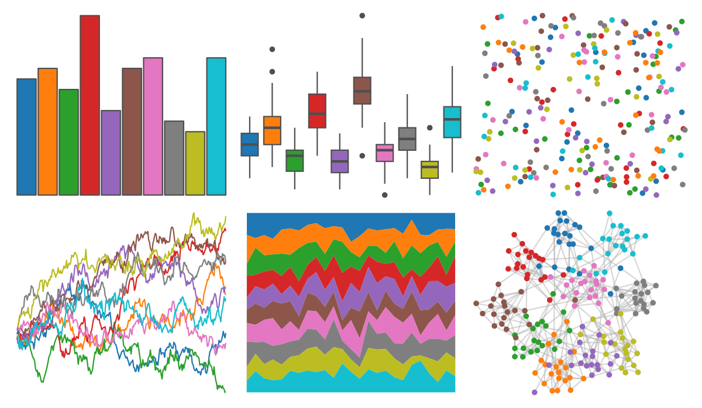

# ggthemes - Classic_10 

::: columns
::: {.column width="50%"}

**Github**

[jrnold/ggthemes](https://github.com/jrnold/ggthemes)
:::

::: {.column width="50%"}

**CRAN**

[ggthemes](https://CRAN.R-project.org/package=ggthemes)
:::
:::

<hr> 

Use with [paletteer](https://emilhvitfeldt.github.io/paletteer/) package:

```r
library(paletteer)
paletteer_d("ggthemes::Classic_10")
```

Use raw:

```r
c("#1F77B4FF", "#FF7F0EFF", "#2CA02CFF", "#D62728FF", "#9467BDFF", "#8C564BFF", "#E377C2FF", "#7F7F7FFF", "#BCBD22FF", "#17BECFFF")
``` 

 

<br>

# Related Palettes

<div class="list" style="display: grid; grid-template-columns: auto auto auto;"> <figure class="figure">
<a href="../../awtools/a_palette/"> </a>
</figure> <figure class="figure">
<a href="../../ggsci/category10_d3/"> </a>
</figure> <figure class="figure">
<a href="../../rcartocolor/Vivid/"> </a>
</figure> <figure class="figure">
<a href="../../rcartocolor/Bold/"> </a>
</figure> <figure class="figure">
<a href="../../RColorBrewer/Set1/"> </a>
</figure> <figure class="figure">
<a href="../../basetheme/royal/"> </a>
</figure> <figure class="figure">
<a href="../../Redmonder/qPBI/"> </a>
</figure> <figure class="figure">
<a href="../../ggthemr/flat/"> </a>
</figure> <figure class="figure">
<a href="../../ggthemes/Tableau_10/"> </a>
</figure> <figure class="figure">
<a href="../../ggsci/default_nejm/"> </a>
</figure> <figure class="figure">
<a href="../../RColorBrewer/Dark2/"> </a>
</figure> <figure class="figure">
<a href="../../ggthemes/few_Medium/"> </a>
</figure> 
</div>
