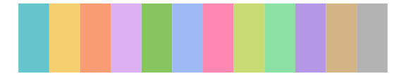

# ggthemes - Classic_10_Light 

::: columns
::: {.column width="50%"}

**Github**

[jrnold/ggthemes](https://github.com/jrnold/ggthemes)
:::

::: {.column width="50%"}

**CRAN**

[ggthemes](https://CRAN.R-project.org/package=ggthemes)
:::
:::

<hr> 

Use with [paletteer](https://emilhvitfeldt.github.io/paletteer/) package:

```r
library(paletteer)
paletteer_d("ggthemes::Classic_10_Light")
```

Use raw:

```r
c("#AEC7E8FF", "#FFBB78FF", "#98DF8AFF", "#FF9896FF", "#C5B0D5FF", "#C49C94FF", "#F7B6D2FF", "#C7C7C7FF", "#DBDB8DFF", "#9EDAE5FF")
``` 

 

<br>

# Related Palettes

<div class="list" style="display: grid; grid-template-columns: auto auto auto;"> <figure class="figure">
<a href="../../awtools/a_palette/"> </a>
</figure> <figure class="figure">
<a href="../../rcartocolor/Pastel/"> </a>
</figure> <figure class="figure">
<a href="../../ggthemes/few_Light/"> </a>
</figure> <figure class="figure">
<a href="../../tvthemes/MegaPearl/"> </a>
</figure> <figure class="figure">
<a href="../../RColorBrewer/Set3/"> </a>
</figure> <figure class="figure">
<a href="../../RColorBrewer/Pastel1/"> </a>
</figure> <figure class="figure">
<a href="../../RColorBrewer/Set2/"> </a>
</figure> <figure class="figure">
<a href="../../ggthemes/Classic_10_Medium/"> </a>
</figure> <figure class="figure">
<a href="../../RColorBrewer/Pastel2/"> </a>
</figure> <figure class="figure">
<a href="../../yarrr/ipod/"> </a>
</figure> <figure class="figure">
<a href="../../ghibli/PonyoLight/"> </a>
</figure> <figure class="figure">
<a href="../../khroma/light/"> </a>
</figure> 
</div>
