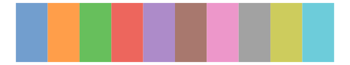
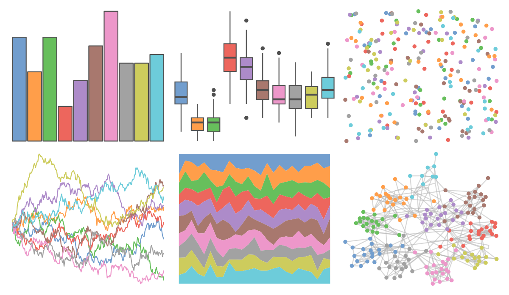

# ggthemes - Classic_10_Medium 

::: columns
::: {.column width="50%"}

**Github**

[jrnold/ggthemes](https://github.com/jrnold/ggthemes)
:::

::: {.column width="50%"}

**CRAN**

[ggthemes](https://CRAN.R-project.org/package=ggthemes)
:::
:::

<hr> 

Use with [paletteer](https://emilhvitfeldt.github.io/paletteer/) package:

```r
library(paletteer)
paletteer_d("ggthemes::Classic_10_Medium")
```

Use raw:

```r
c("#729ECEFF", "#FF9E4AFF", "#67BF5CFF", "#ED665DFF", "#AD8BC9FF", "#A8786EFF", "#ED97CAFF", "#A2A2A2FF", "#CDCC5DFF", "#6DCCDAFF")
``` 

 

<br>

# Related Palettes

<div class="list" style="display: grid; grid-template-columns: auto auto auto;"> <figure class="figure">
<a href="../../amerika/Dem_Ind_Rep3/"> </a>
</figure> <figure class="figure">
<a href="../../ggthemes/Tableau_10/"> </a>
</figure> <figure class="figure">
<a href="../../ggthemes/Superfishel_Stone/"> </a>
</figure> <figure class="figure">
<a href="../../ggthemes/few_Light/"> </a>
</figure> <figure class="figure">
<a href="../../rcartocolor/Pastel/"> </a>
</figure> <figure class="figure">
<a href="../../RColorBrewer/Set2/"> </a>
</figure> <figure class="figure">
<a href="../../MoMAColors/Lupi/"> </a>
</figure> <figure class="figure">
<a href="../../basetheme/brutal/"> </a>
</figure> <figure class="figure">
<a href="../../ggthemes/few_Medium/"> </a>
</figure> <figure class="figure">
<a href="../../ggthemes/Classic_10_Light/"> </a>
</figure> <figure class="figure">
<a href="../../RColorBrewer/Set3/"> </a>
</figure> <figure class="figure">
<a href="../../ggsci/observable10_observable/"> </a>
</figure> 
</div>
