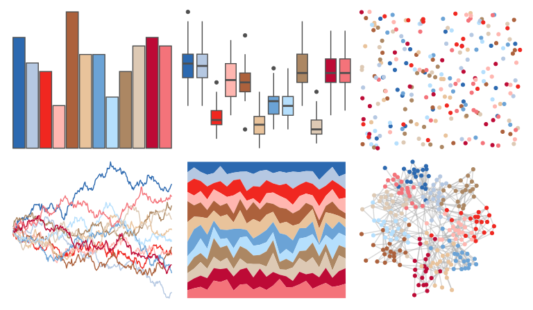

# ggthemes - Classic_Blue_Red_12 

::: columns
::: {.column width="50%"}

**Github**

[jrnold/ggthemes](https://github.com/jrnold/ggthemes)
:::

::: {.column width="50%"}

**CRAN**

[ggthemes](https://CRAN.R-project.org/package=ggthemes)
:::
:::

<hr> 

Use with [paletteer](https://emilhvitfeldt.github.io/paletteer/) package:

```r
library(paletteer)
paletteer_d("ggthemes::Classic_Blue_Red_12")
```

Use raw:

```r
c("#2C69B0FF", "#B5C8E2FF", "#F02720FF", "#FFB6B0FF", "#AC613CFF", "#E9C39BFF", "#6BA3D6FF", "#B5DFFDFF", "#AC8763FF", "#DDC9B4FF", "#BD0A36FF", "#F4737AFF")
``` 

 

<br>

# Related Palettes

<div class="list" style="display: grid; grid-template-columns: auto auto auto;"> <figure class="figure">
<a href="../../awtools/a_palette/"> </a>
</figure> <figure class="figure">
<a href="../../ggthemes/Red_Blue_Brown/"> </a>
</figure> <figure class="figure">
<a href="../../ggsci/nrc_npg/"> </a>
</figure> <figure class="figure">
<a href="../../tvthemes/Day/"> </a>
</figure> <figure class="figure">
<a href="../../palettetown/flaaffy/"> </a>
</figure> <figure class="figure">
<a href="../../palettetown/latias/"> </a>
</figure> <figure class="figure">
<a href="../../palettetown/vileplume/"> </a>
</figure> <figure class="figure">
<a href="../../palettetown/seaking/"> </a>
</figure> <figure class="figure">
<a href="../../khroma/sunset/"> </a>
</figure> <figure class="figure">
<a href="../../khroma/BuRd/"> </a>
</figure> <figure class="figure">
<a href="../../palettetown/totodile/"> </a>
</figure> <figure class="figure">
<a href="../../ggthemes/Color_Blind/"> </a>
</figure> 
</div>
