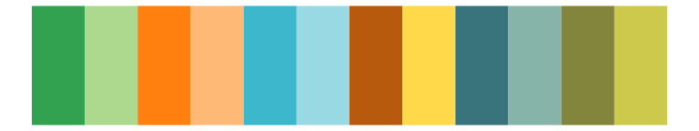
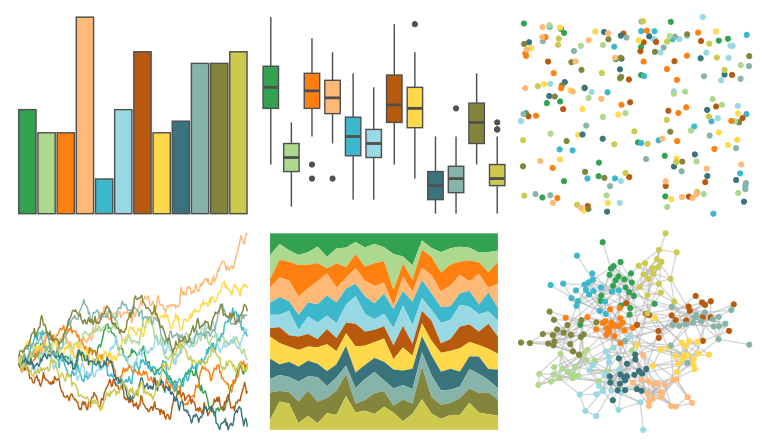
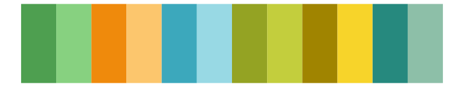
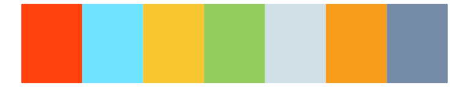
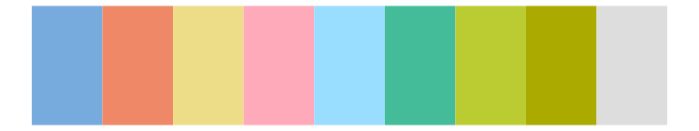
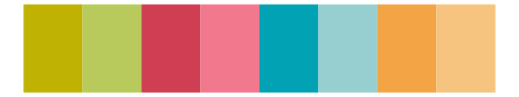
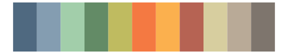
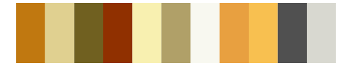
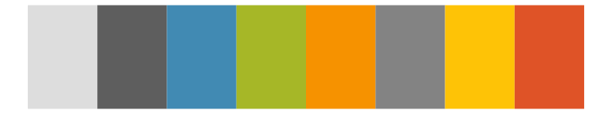
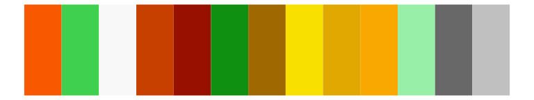

# ggthemes - Classic_Green_Orange_12 

::: columns
::: {.column width="50%"}

**Github**

[jrnold/ggthemes](https://github.com/jrnold/ggthemes)
:::

::: {.column width="50%"}

**CRAN**

[ggthemes](https://CRAN.R-project.org/package=ggthemes)
:::
:::

<hr> 

Use with [paletteer](https://emilhvitfeldt.github.io/paletteer/) package:

```r
library(paletteer)
paletteer_d("ggthemes::Classic_Green_Orange_12")
```

Use raw:

```r
c("#32A251FF", "#ACD98DFF", "#FF7F0FFF", "#FFB977FF", "#3CB7CCFF", "#98D9E4FF", "#B85A0DFF", "#FFD94AFF", "#39737CFF", "#86B4A9FF", "#82853BFF", "#CCC94DFF")
``` 

 

<br>

# Related Palettes

<div class="list" style="display: grid; grid-template-columns: auto auto auto;"> <figure class="figure">
<a href="../../awtools/a_palette/"> </a>
</figure> <figure class="figure">
<a href="../../ggthemes/Green_Orange_Teal/"> </a>
</figure> <figure class="figure">
<a href="../../ggthemes/Classic_Green_Orange_6/"> </a>
</figure> <figure class="figure">
<a href="../../ggsci/legacy_tron/"> </a>
</figure> <figure class="figure">
<a href="../../khroma/light/"> </a>
</figure> <figure class="figure">
<a href="../../palettetown/bayleef/"> </a>
</figure> <figure class="figure">
<a href="../../palettetown/hoothoot/"> </a>
</figure> <figure class="figure">
<a href="../../ggthemes/Summer/"> </a>
</figure> <figure class="figure">
<a href="../../ggthemes/Miller_Stone/"> </a>
</figure> <figure class="figure">
<a href="../../palettetown/growlithe/"> </a>
</figure> <figure class="figure">
<a href="../../Redmonder/qMSOMrq/"> </a>
</figure> <figure class="figure">
<a href="../../palettetown/ho_oh/"> </a>
</figure> 
</div>
