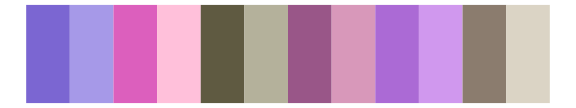
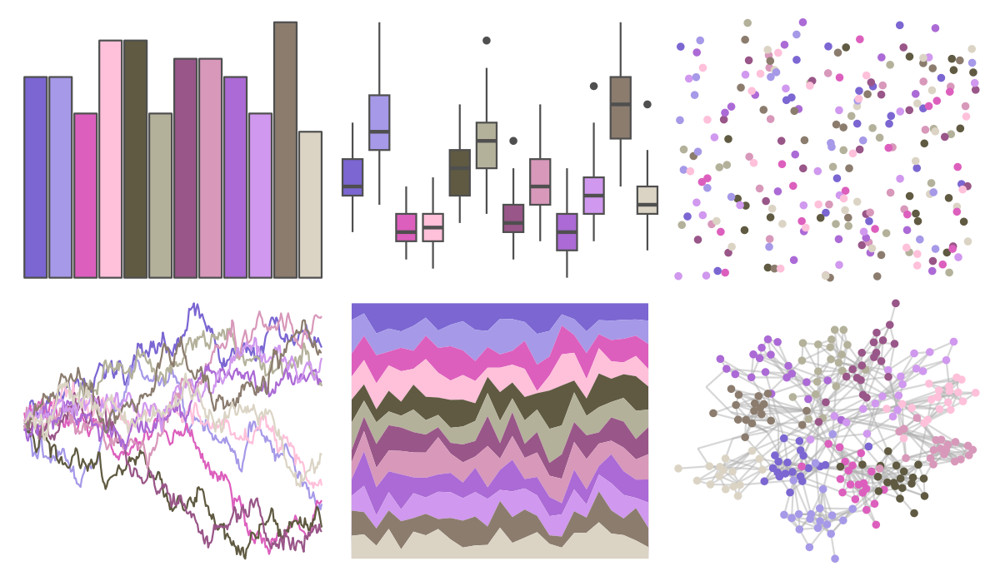
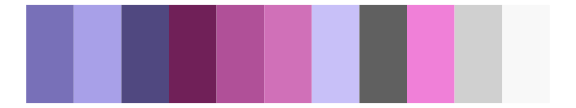
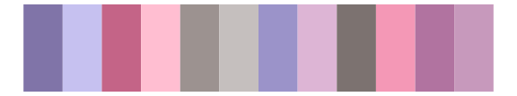

# ggthemes - Classic_Purple_Gray_12 

::: columns
::: {.column width="50%"}

**Github**

[jrnold/ggthemes](https://github.com/jrnold/ggthemes)
:::

::: {.column width="50%"}

**CRAN**

[ggthemes](https://CRAN.R-project.org/package=ggthemes)
:::
:::

<hr> 

Use with [paletteer](https://emilhvitfeldt.github.io/paletteer/) package:

```r
library(paletteer)
paletteer_d("ggthemes::Classic_Purple_Gray_12")
```

Use raw:

```r
c("#7B66D2FF", "#A699E8FF", "#DC5FBDFF", "#FFC0DAFF", "#5F5A41FF", "#B4B19BFF", "#995688FF", "#D898BAFF", "#AB6AD5FF", "#D098EEFF", "#8B7C6EFF", "#DBD4C5FF")
``` 

 

<br>

# Related Palettes

<div class="list" style="display: grid; grid-template-columns: auto auto auto;"> <figure class="figure">
<a href="../../awtools/a_palette/"> </a>
</figure> <figure class="figure">
<a href="../../palettetown/granbull/"> </a>
</figure> <figure class="figure">
<a href="../../palettetown/zubat/"> </a>
</figure> <figure class="figure">
<a href="../../palettetown/mewtwo/"> </a>
</figure> <figure class="figure">
<a href="../../beyonce/X90/"> </a>
</figure> <figure class="figure">
<a href="../../ggthemes/Purple_Pink_Gray/"> </a>
</figure> <figure class="figure">
<a href="../../palettetown/nidoranm/"> </a>
</figure> <figure class="figure">
<a href="../../ggthemes/Classic_Purple_Gray_6/"> </a>
</figure> <figure class="figure">
<a href="../../palettetown/gligar/"> </a>
</figure> <figure class="figure">
<a href="../../palettetown/venomoth/"> </a>
</figure> <figure class="figure">
<a href="../../beyonce/X49/"> </a>
</figure> <figure class="figure">
<a href="../../palettetown/wooper/"> </a>
</figure> 
</div>
