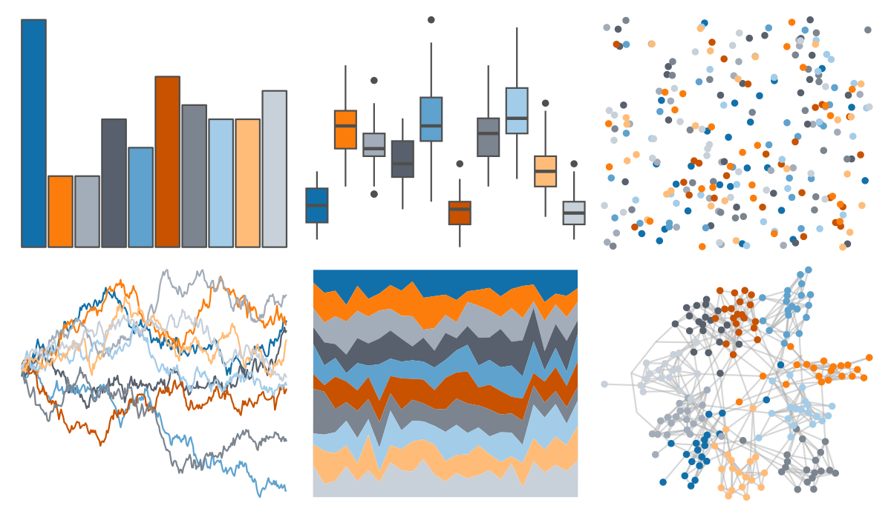
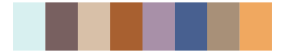

# ggthemes - Color_Blind 

::: columns
::: {.column width="50%"}

**Github**

[jrnold/ggthemes](https://github.com/jrnold/ggthemes)
:::

::: {.column width="50%"}

**CRAN**

[ggthemes](https://CRAN.R-project.org/package=ggthemes)
:::
:::

<hr> 

Use with [paletteer](https://emilhvitfeldt.github.io/paletteer/) package:

```r
library(paletteer)
paletteer_d("ggthemes::Color_Blind")
```

Use raw:

```r
c("#1170AAFF", "#FC7D0BFF", "#A3ACB9FF", "#57606CFF", "#5FA2CEFF", "#C85200FF", "#7B848FFF", "#A3CCE9FF", "#FFBC79FF", "#C8D0D9FF")
``` 

 

<br>

# Related Palettes

<div class="list" style="display: grid; grid-template-columns: auto auto auto;"> <figure class="figure">
<a href="../../amerika/Dem_Ind_Rep3/"> </a>
</figure> <figure class="figure">
<a href="../../ggthemes/Classic_Color_Blind/"> </a>
</figure> <figure class="figure">
<a href="../../calecopal/figmtn/"> </a>
</figure> <figure class="figure">
<a href="../../ochRe/namatjira_div/"> </a>
</figure> <figure class="figure">
<a href="../../ochRe/namatjira_qual/"> </a>
</figure> <figure class="figure">
<a href="../../palettetown/mudkip/"> </a>
</figure> <figure class="figure">
<a href="../../khroma/BuRd/"> </a>
</figure> <figure class="figure">
<a href="../../palettetown/azumarill/"> </a>
</figure> <figure class="figure">
<a href="../../palettetown/snubbull/"> </a>
</figure> <figure class="figure">
<a href="../../palettetown/marshtomp/"> </a>
</figure> <figure class="figure">
<a href="../../ggsci/nrc_npg/"> </a>
</figure> <figure class="figure">
<a href="../../Redmonder/qPBI/"> </a>
</figure> 
</div>
