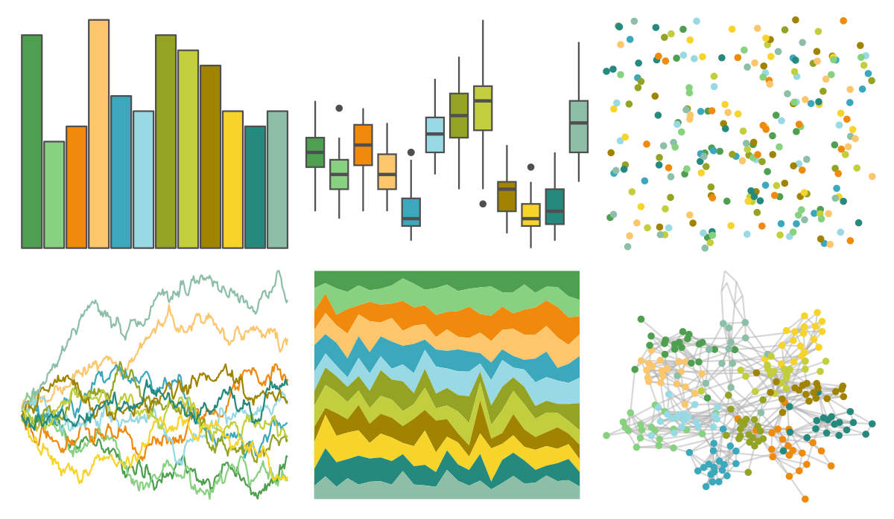

# ggthemes - Green_Orange_Teal 

::: columns
::: {.column width="50%"}

**Github**

[jrnold/ggthemes](https://github.com/jrnold/ggthemes)
:::

::: {.column width="50%"}

**CRAN**

[ggthemes](https://CRAN.R-project.org/package=ggthemes)
:::
:::

<hr> 

Use with [paletteer](https://emilhvitfeldt.github.io/paletteer/) package:

```r
library(paletteer)
paletteer_d("ggthemes::Green_Orange_Teal")
```

Use raw:

```r
c("#4E9F50FF", "#87D180FF", "#EF8A0CFF", "#FCC66DFF", "#3CA8BCFF", "#98D9E4FF", "#94A323FF", "#C3CE3DFF", "#A08400FF", "#F7D42AFF", "#26897EFF", "#8DBFA8FF")
``` 

 

<br>

# Related Palettes

<div class="list" style="display: grid; grid-template-columns: auto auto auto;"> <figure class="figure">
<a href="../../awtools/a_palette/"> </a>
</figure> <figure class="figure">
<a href="../../ButterflyColors/hamadryas_feronia/"> </a>
</figure> <figure class="figure">
<a href="../../ButterflyColors/hamadryas_feronia/"> </a>
</figure> <figure class="figure">
<a href="../../ggthemes/Classic_Green_Orange_12/"> </a>
</figure> <figure class="figure">
<a href="../../palettetown/omastar/"> </a>
</figure> <figure class="figure">
<a href="../../khroma/light/"> </a>
</figure> <figure class="figure">
<a href="../../palettetown/skiploom/"> </a>
</figure> <figure class="figure">
<a href="../../ggthemes/excel_Depth/"> </a>
</figure> <figure class="figure">
<a href="../../palettetown/exeggutor/"> </a>
</figure> <figure class="figure">
<a href="../../palettetown/bayleef/"> </a>
</figure> <figure class="figure">
<a href="../../tvthemes/Tyrell/"> </a>
</figure> <figure class="figure">
<a href="../../palettetown/lombre/"> </a>
</figure> 
</div>
