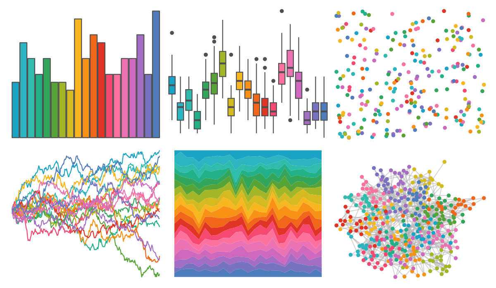
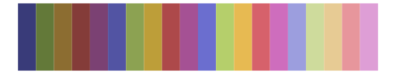

# ggthemes - Hue_Circle 

::: columns
::: {.column width="50%"}

**Github**

[jrnold/ggthemes](https://github.com/jrnold/ggthemes)
:::

::: {.column width="50%"}

**CRAN**

[ggthemes](https://CRAN.R-project.org/package=ggthemes)
:::
:::

<hr> 

Use with [paletteer](https://emilhvitfeldt.github.io/paletteer/) package:

```r
library(paletteer)
paletteer_d("ggthemes::Hue_Circle")
```

Use raw:

```r
c("#1BA3C6FF", "#2CB5C0FF", "#30BCADFF", "#21B087FF", "#33A65CFF", "#57A337FF", "#A2B627FF", "#D5BB21FF", "#F8B620FF", "#F89217FF", "#F06719FF", "#E03426FF", "#F64971FF", "#FC719EFF", "#EB73B3FF", "#CE69BEFF", "#A26DC2FF", "#7873C0FF", "#4F7CBAFF")
``` 

 

<br>

# Related Palettes

<div class="list" style="display: grid; grid-template-columns: auto auto auto;"> <figure class="figure">
<a href="../../amerika/Dem_Ind_Rep3/"> </a>
</figure> <figure class="figure">
<a href="../../ggthemes/Classic_Cyclic/"> </a>
</figure> <figure class="figure">
<a href="../../ggsci/category20_d3/"> </a>
</figure> <figure class="figure">
<a href="../../MetBrewer/Signac/"> </a>
</figure> <figure class="figure">
<a href="../../ggthemes/manyeys/"> </a>
</figure> <figure class="figure">
<a href="../../ggthemes/Classic_20/"> </a>
</figure> <figure class="figure">
<a href="../../ggsci/category20b_d3/"> </a>
</figure> <figure class="figure">
<a href="../../rcartocolor/Vivid/"> </a>
</figure> <figure class="figure">
<a href="../../ggthemes/stata_s2color/"> </a>
</figure> <figure class="figure">
<a href="../../LaCroixColoR/paired/"> </a>
</figure> <figure class="figure">
<a href="../../ggthemes/Tableau_20/"> </a>
</figure> <figure class="figure">
<a href="../../miscpalettes/pastel/"> </a>
</figure> 
</div>
