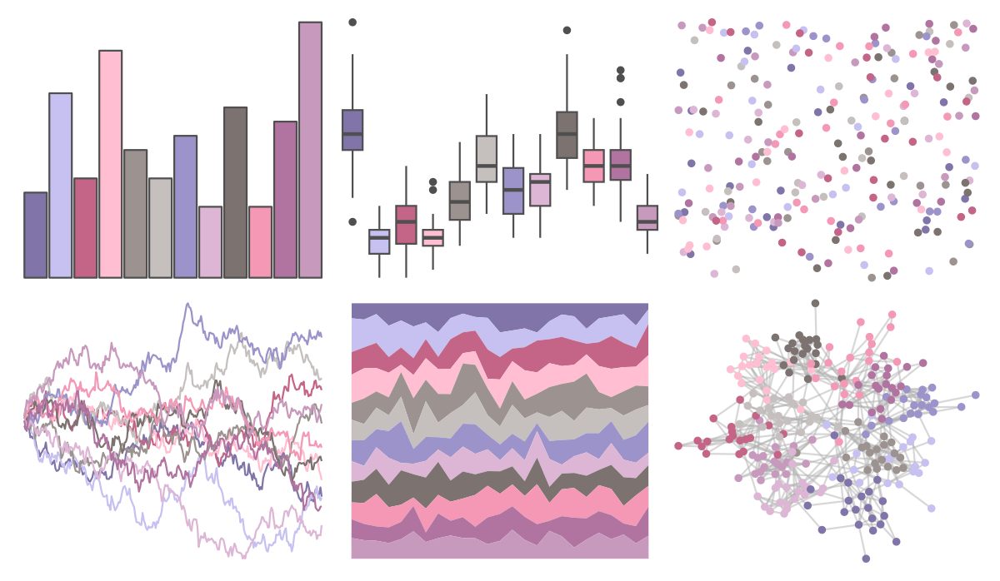

# ggthemes - Purple_Pink_Gray 

::: columns
::: {.column width="50%"}

**Github**

[jrnold/ggthemes](https://github.com/jrnold/ggthemes)
:::

::: {.column width="50%"}

**CRAN**

[ggthemes](https://CRAN.R-project.org/package=ggthemes)
:::
:::

<hr> 

Use with [paletteer](https://emilhvitfeldt.github.io/paletteer/) package:

```r
library(paletteer)
paletteer_d("ggthemes::Purple_Pink_Gray")
```

Use raw:

```r
c("#8074A8FF", "#C6C1F0FF", "#C46487FF", "#FFBED1FF", "#9C9290FF", "#C5BFBEFF", "#9B93C9FF", "#DDB5D5FF", "#7C7270FF", "#F498B6FF", "#B173A0FF", "#C799BCFF")
``` 

 

<br>

# Related Palettes

<div class="list" style="display: grid; grid-template-columns: auto auto auto;"> <figure class="figure">
<a href="../../amerika/Dem_Ind_Rep3/"> </a>
</figure> <figure class="figure">
<a href="../../ggthemes/Classic_Purple_Gray_12/"> </a>
</figure> <figure class="figure">
<a href="../../beyonce/X90/"> </a>
</figure> <figure class="figure">
<a href="../../palettetown/blissey/"> </a>
</figure> <figure class="figure">
<a href="../../feathers/galah/"> </a>
</figure> <figure class="figure">
<a href="../../palettetown/corsola/"> </a>
</figure> <figure class="figure">
<a href="../../palettetown/mewtwo/"> </a>
</figure> <figure class="figure">
<a href="../../palettetown/metang/"> </a>
</figure> <figure class="figure">
<a href="../../palettetown/poliwag/"> </a>
</figure> <figure class="figure">
<a href="../../PrettyCols/Summer/"> </a>
</figure> <figure class="figure">
<a href="../../palettetown/latios/"> </a>
</figure> <figure class="figure">
<a href="../../MetBrewer/Cassatt1/"> </a>
</figure> 
</div>
