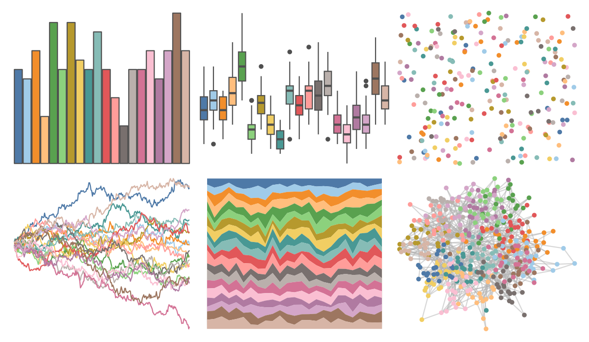

# ggthemes - Tableau_20 

::: columns
::: {.column width="50%"}

**Github**

[jrnold/ggthemes](https://github.com/jrnold/ggthemes)
:::

::: {.column width="50%"}

**CRAN**

[ggthemes](https://CRAN.R-project.org/package=ggthemes)
:::
:::

<hr> 

Use with [paletteer](https://emilhvitfeldt.github.io/paletteer/) package:

```r
library(paletteer)
paletteer_d("ggthemes::Tableau_20")
```

Use raw:

```r
c("#4E79A7FF", "#A0CBE8FF", "#F28E2BFF", "#FFBE7DFF", "#59A14FFF", "#8CD17DFF", "#B6992DFF", "#F1CE63FF", "#499894FF", "#86BCB6FF", "#E15759FF", "#FF9D9AFF", "#79706EFF", "#BAB0ACFF", "#D37295FF", "#FABFD2FF", "#B07AA1FF", "#D4A6C8FF", "#9D7660FF", "#D7B5A6FF")
``` 

 

<br>

# Related Palettes

<div class="list" style="display: grid; grid-template-columns: auto auto auto;"> <figure class="figure">
<a href="../../amerika/Dem_Ind_Rep3/"> </a>
</figure> <figure class="figure">
<a href="../../ggthemes/Classic_20/"> </a>
</figure> <figure class="figure">
<a href="../../ggsci/category20_d3/"> </a>
</figure> <figure class="figure">
<a href="../../ggsci/category20c_d3/"> </a>
</figure> <figure class="figure">
<a href="../../ggthemes/stata_s2color/"> </a>
</figure> <figure class="figure">
<a href="../../palettetown/blastoise/"> </a>
</figure> <figure class="figure">
<a href="../../palettetown/latias/"> </a>
</figure> <figure class="figure">
<a href="../../palettetown/snorlax/"> </a>
</figure> <figure class="figure">
<a href="../../ggthemes/Hue_Circle/"> </a>
</figure> <figure class="figure">
<a href="../../IslamicArt/shiraz2/"> </a>
</figure> <figure class="figure">
<a href="../../palettetown/wartortle/"> </a>
</figure> <figure class="figure">
<a href="../../palettetown/butterfree/"> </a>
</figure> 
</div>
