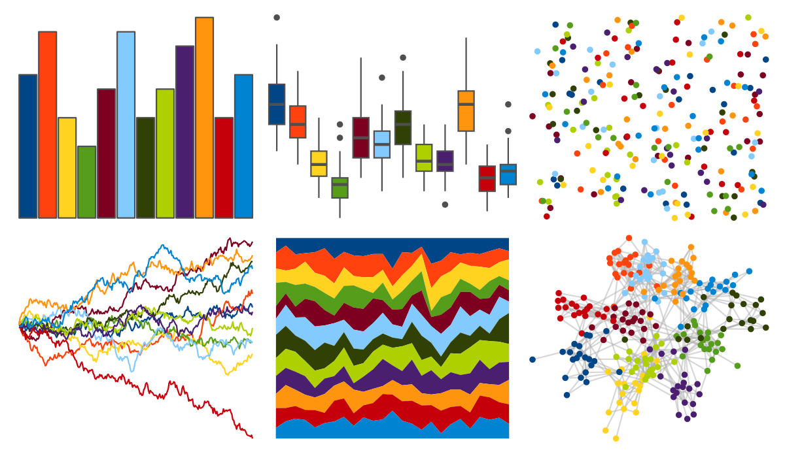
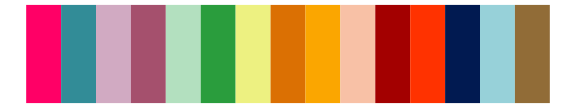

# ggthemes - calc 

::: columns
::: {.column width="50%"}

**Github**

[jrnold/ggthemes](https://github.com/jrnold/ggthemes)
:::

::: {.column width="50%"}

**CRAN**

[ggthemes](https://CRAN.R-project.org/package=ggthemes)
:::
:::

<hr> 

Use with [paletteer](https://emilhvitfeldt.github.io/paletteer/) package:

```r
library(paletteer)
paletteer_d("ggthemes::calc")
```

Use raw:

```r
c("#004586FF", "#FF420EFF", "#FFD320FF", "#579D1CFF", "#7E0021FF", "#83CAFFFF", "#314004FF", "#AECF00FF", "#4B1F6FFF", "#FF950EFF", "#C5000BFF", "#0084D1FF")
``` 

 

<br>

# Related Palettes

<div class="list" style="display: grid; grid-template-columns: auto auto auto;"> <figure class="figure">
<a href="../../amerika/Dem_Ind_Rep3/"> </a>
</figure> <figure class="figure">
<a href="../../jcolors/rainbow/"> </a>
</figure> <figure class="figure">
<a href="../../Redmonder/qMSOStd/"> </a>
</figure> <figure class="figure">
<a href="../../LaCroixColoR/KiwiSandia/"> </a>
</figure> <figure class="figure">
<a href="../../MexBrewer/Huida/"> </a>
</figure> <figure class="figure">
<a href="../../MoMAColors/Warhol/"> </a>
</figure> <figure class="figure">
<a href="../../yarrr/basel/"> </a>
</figure> <figure class="figure">
<a href="../../jcolors/pal7/"> </a>
</figure> <figure class="figure">
<a href="../../RSkittleBrewer/smarties/"> </a>
</figure> <figure class="figure">
<a href="../../werpals/benagil/"> </a>
</figure> <figure class="figure">
<a href="../../ochRe/healthy_reef/"> </a>
</figure> <figure class="figure">
<a href="../../werpals/okavango/"> </a>
</figure> 
</div>
