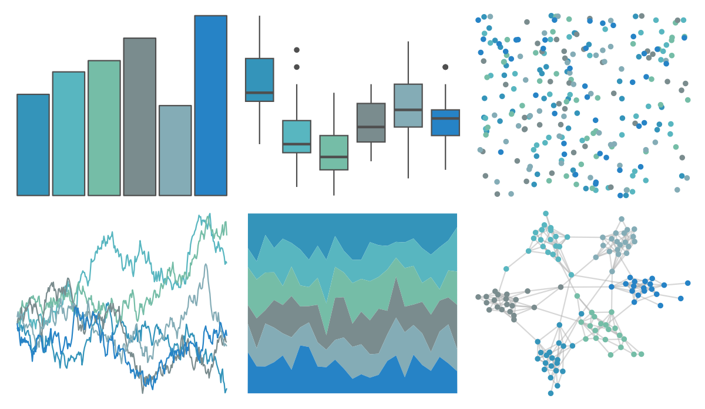

# ggthemes - excel_Blue_Green 

::: columns
::: {.column width="50%"}

**Github**

[jrnold/ggthemes](https://github.com/jrnold/ggthemes)
:::

::: {.column width="50%"}

**CRAN**

[ggthemes](https://CRAN.R-project.org/package=ggthemes)
:::
:::

<hr> 

Use with [paletteer](https://emilhvitfeldt.github.io/paletteer/) package:

```r
library(paletteer)
paletteer_d("ggthemes::excel_Blue_Green")
```

Use raw:

```r
c("#3494BAFF", "#58B6C0FF", "#75BDA7FF", "#7A8C8EFF", "#84ACB6FF", "#2683C6FF")
``` 

 

<br>

# Related Palettes

<div class="list" style="display: grid; grid-template-columns: auto auto auto;"> <figure class="figure">
<a href="../../awtools/a_palette/"> </a>
</figure> <figure class="figure">
<a href="../../ButterflyColors/hamadryas_feronia/"> </a>
</figure> <figure class="figure">
<a href="../../ButterflyColors/hamadryas_feronia/"> </a>
</figure> <figure class="figure">
<a href="../../nord/frost/"> </a>
</figure> <figure class="figure">
<a href="../../soilpalettes/gley/"> </a>
</figure> <figure class="figure">
<a href="../../Redmonder/qMSOBuGn/"> </a>
</figure> <figure class="figure">
<a href="../../ggthemes/excel_Blue_Warm/"> </a>
</figure> <figure class="figure">
<a href="../../fishualize/Opisthonema_oglinum/"> </a>
</figure> <figure class="figure">
<a href="../../musculusColors/Bmlunge/"> </a>
</figure> <figure class="figure">
<a href="../../ButterflyColors/astraptes_fulgerator/"> </a>
</figure> <figure class="figure">
<a href="../../ggthemes/excel_Violet/"> </a>
</figure> <figure class="figure">
<a href="../../nord/afternoon_prarie/"> </a>
</figure> 
</div>
