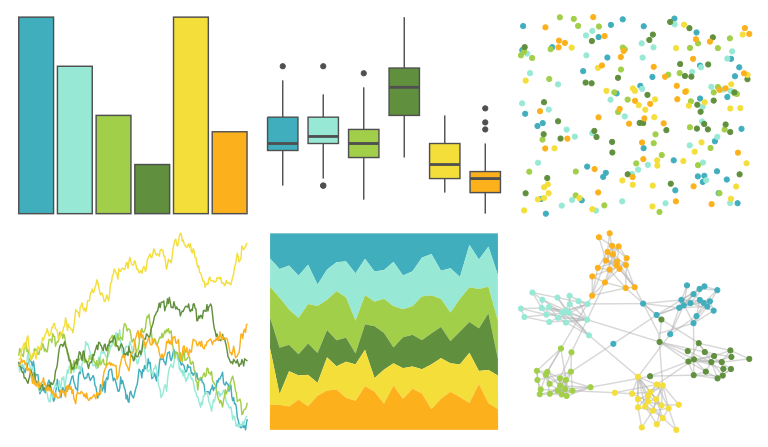

# ggthemes - excel_Depth 

::: columns
::: {.column width="50%"}

**Github**

[jrnold/ggthemes](https://github.com/jrnold/ggthemes)
:::

::: {.column width="50%"}

**CRAN**

[ggthemes](https://CRAN.R-project.org/package=ggthemes)
:::
:::

<hr> 

Use with [paletteer](https://emilhvitfeldt.github.io/paletteer/) package:

```r
library(paletteer)
paletteer_d("ggthemes::excel_Depth")
```

Use raw:

```r
c("#41AEBDFF", "#97E9D5FF", "#A2CF49FF", "#608F3DFF", "#F4DE3AFF", "#FCB11CFF")
``` 

 

<br>

# Related Palettes

<div class="list" style="display: grid; grid-template-columns: auto auto auto;"> <figure class="figure">
<a href="../../awtools/a_palette/"> </a>
</figure> <figure class="figure">
<a href="../../fishualize/Scarus_ghobban/"> </a>
</figure> <figure class="figure">
<a href="../../ggthemes/Green_Orange_Teal/"> </a>
</figure> <figure class="figure">
<a href="../../ggthemes/excel_Madison/"> </a>
</figure> <figure class="figure">
<a href="../../fishualize/Forcipiger_longirostris/"> </a>
</figure> <figure class="figure">
<a href="../../palettetown/omastar/"> </a>
</figure> <figure class="figure">
<a href="../../Redmonder/qMSOGn/"> </a>
</figure> <figure class="figure">
<a href="../../nationalparkcolors/Yellowstone/"> </a>
</figure> <figure class="figure">
<a href="../../Redmonder/qMSOGnYl/"> </a>
</figure> <figure class="figure">
<a href="../../wesanderson/Moonrise3/"> </a>
</figure> <figure class="figure">
<a href="../../lisa/RemediosVaro/"> </a>
</figure> <figure class="figure">
<a href="../../tvthemes/Tyrell/"> </a>
</figure> 
</div>
