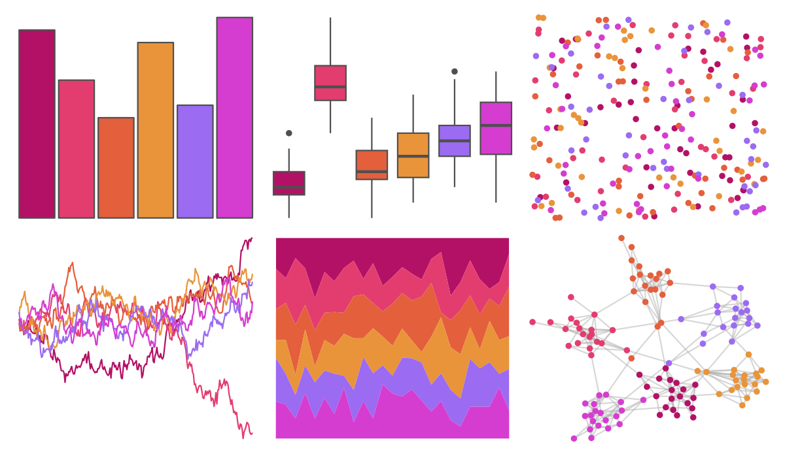
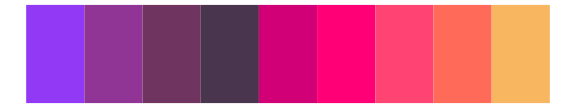

# ggthemes - excel_Ion_Boardroom 

::: columns
::: {.column width="50%"}

**Github**

[jrnold/ggthemes](https://github.com/jrnold/ggthemes)
:::

::: {.column width="50%"}

**CRAN**

[ggthemes](https://CRAN.R-project.org/package=ggthemes)
:::
:::

<hr> 

Use with [paletteer](https://emilhvitfeldt.github.io/paletteer/) package:

```r
library(paletteer)
paletteer_d("ggthemes::excel_Ion_Boardroom")
```

Use raw:

```r
c("#B31166FF", "#E33D6FFF", "#E45F3CFF", "#E9943AFF", "#9B6BF2FF", "#D53DD0FF")
``` 

 

<br>

# Related Palettes

<div class="list" style="display: grid; grid-template-columns: auto auto auto;"> <figure class="figure">
<a href="../../amerika/Dem_Ind_Rep3/"> </a>
</figure> <figure class="figure">
<a href="../../lisa/JacobLawrence_1/"> </a>
</figure> <figure class="figure">
<a href="../../ltc/franscoise/"> </a>
</figure> <figure class="figure">
<a href="../../peRReo/natti/"> </a>
</figure> <figure class="figure">
<a href="../../waRhol/camo_87_2/"> </a>
</figure> <figure class="figure">
<a href="../../trekcolors/lcars_2375/"> </a>
</figure> <figure class="figure">
<a href="../../vapoRwave/newRetro/"> </a>
</figure> <figure class="figure">
<a href="../../rcartocolor/SunsetDark/"> </a>
</figure> <figure class="figure">
<a href="../../rcartocolor/ag_Sunset/"> </a>
</figure> <figure class="figure">
<a href="../../PNWColors/Sunset2/"> </a>
</figure> <figure class="figure">
<a href="../../vapeplot/sunset/"> </a>
</figure> <figure class="figure">
<a href="../../vapoRwave/sunSet/"> </a>
</figure> 
</div>
