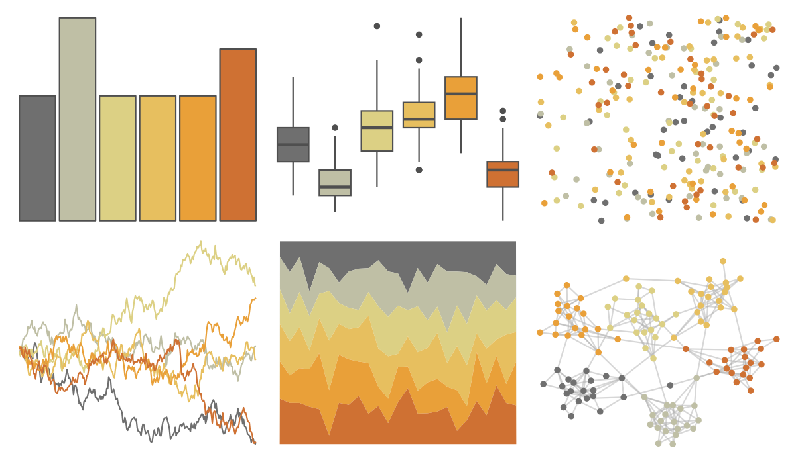
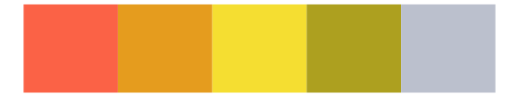
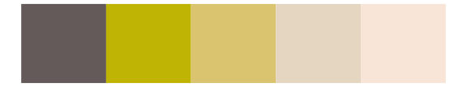

# ggthemes - excel_Mesh 

::: columns
::: {.column width="50%"}

**Github**

[jrnold/ggthemes](https://github.com/jrnold/ggthemes)
:::

::: {.column width="50%"}

**CRAN**

[ggthemes](https://CRAN.R-project.org/package=ggthemes)
:::
:::

<hr> 

Use with [paletteer](https://emilhvitfeldt.github.io/paletteer/) package:

```r
library(paletteer)
paletteer_d("ggthemes::excel_Mesh")
```

Use raw:

```r
c("#6F6F6FFF", "#BFBFA5FF", "#DCD084FF", "#E7BF5FFF", "#E9A039FF", "#CF7133FF")
``` 

 

<br>

# Related Palettes

<div class="list" style="display: grid; grid-template-columns: auto auto auto;"> <figure class="figure">
<a href="../../awtools/a_palette/"> </a>
</figure> <figure class="figure">
<a href="../../lisa/J_M_W_Turner/"> </a>
</figure> <figure class="figure">
<a href="../../ggthemes/excel_Retrospect/"> </a>
</figure> <figure class="figure">
<a href="../../ggthemes/excel_Orange/"> </a>
</figure> <figure class="figure">
<a href="../../lisa/RobertDelaunay_1/"> </a>
</figure> <figure class="figure">
<a href="../../rcartocolor/Fall/"> </a>
</figure> <figure class="figure">
<a href="../../fishualize/Acanthisthius_brasilianus/"> </a>
</figure> <figure class="figure">
<a href="../../fishualize/Salmo_salar/"> </a>
</figure> <figure class="figure">
<a href="../../fishualize/Chaetodon_sedentarius/"> </a>
</figure> <figure class="figure">
<a href="../../fishualize/Oncorhynchus_tshawytscha/"> </a>
</figure> <figure class="figure">
<a href="../../lisa/FernandoBotero/"> </a>
</figure> <figure class="figure">
<a href="../../lisa/SandroBotticelli/"> </a>
</figure> 
</div>
