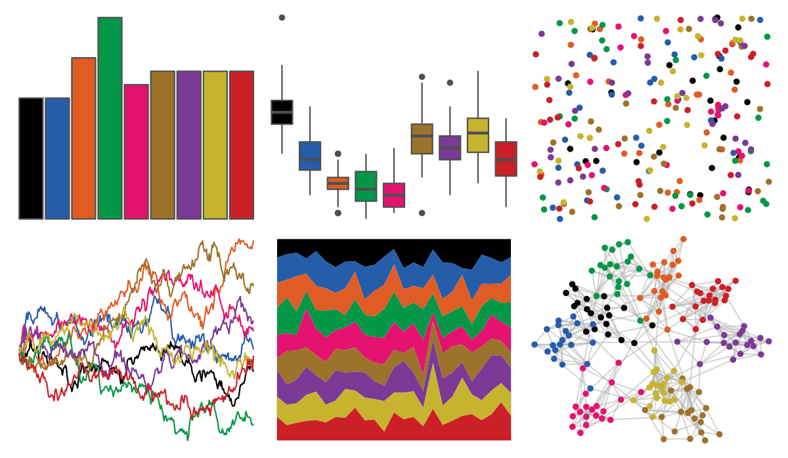
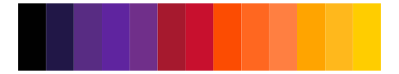

# ggthemes - few_Dark 

::: columns
::: {.column width="50%"}

**Github**

[jrnold/ggthemes](https://github.com/jrnold/ggthemes)
:::

::: {.column width="50%"}

**CRAN**

[ggthemes](https://CRAN.R-project.org/package=ggthemes)
:::
:::

<hr> 

Use with [paletteer](https://emilhvitfeldt.github.io/paletteer/) package:

```r
library(paletteer)
paletteer_d("ggthemes::few_Dark")
```

Use raw:

```r
c("#000000FF", "#265DABFF", "#DF5C24FF", "#059748FF", "#E5126FFF", "#9D722AFF", "#7B3A96FF", "#C7B42EFF", "#CB2027FF")
``` 

 

<br>

# Related Palettes

<div class="list" style="display: grid; grid-template-columns: auto auto auto;"> <figure class="figure">
<a href="../../amerika/Dem_Ind_Rep3/"> </a>
</figure> <figure class="figure">
<a href="../../nbapalettes/nuggets_city2/"> </a>
</figure> <figure class="figure">
<a href="../../ltc/hat/"> </a>
</figure> <figure class="figure">
<a href="../../ltc/ten_colors/"> </a>
</figure> <figure class="figure">
<a href="../../peRReo/badbunny2/"> </a>
</figure> <figure class="figure">
<a href="../../nbapalettes/grizzlies/"> </a>
</figure> <figure class="figure">
<a href="../../nbapalettes/suns_city/"> </a>
</figure> <figure class="figure">
<a href="../../tvthemes/Ruby/"> </a>
</figure> <figure class="figure">
<a href="../../futurevisions/pegasi/"> </a>
</figure> <figure class="figure">
<a href="../../ghibli/MononokeMedium/"> </a>
</figure> <figure class="figure">
<a href="../../ggsci/default_uchicago/"> </a>
</figure> <figure class="figure">
<a href="../../NatParksPalettes/Volcanoes/"> </a>
</figure> 
</div>
