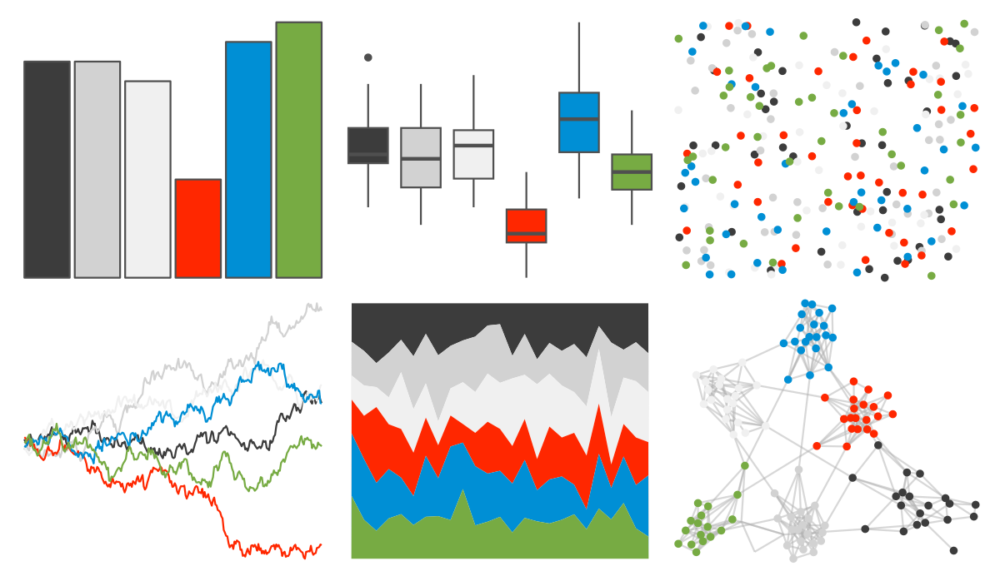

# ggthemes - fivethirtyeight 

::: columns
::: {.column width="50%"}

**Github**

[jrnold/ggthemes](https://github.com/jrnold/ggthemes)
:::

::: {.column width="50%"}

**CRAN**

[ggthemes](https://CRAN.R-project.org/package=ggthemes)
:::
:::

<hr> 

Use with [paletteer](https://emilhvitfeldt.github.io/paletteer/) package:

```r
library(paletteer)
paletteer_d("ggthemes::fivethirtyeight")
```

Use raw:

```r
c("#3C3C3CFF", "#D2D2D2FF", "#F0F0F0FF", "#FF2700FF", "#008FD5FF", "#77AB43FF")
``` 

 

<br>

# Related Palettes

<div class="list" style="display: grid; grid-template-columns: auto auto auto;"> <figure class="figure">
<a href="../../amerika/Dem_Ind_Rep3/"> </a>
</figure> <figure class="figure">
<a href="../../palettetown/larvitar/"> </a>
</figure> <figure class="figure">
<a href="../../ggsci/signature_substitutions_cosmic/"> </a>
</figure> <figure class="figure">
<a href="../../palettetown/umbreon/"> </a>
</figure> <figure class="figure">
<a href="../../ggthemr/carrot/"> </a>
</figure> <figure class="figure">
<a href="../../ggpomological/pomological_base/"> </a>
</figure> <figure class="figure">
<a href="../../palettetown/ralts/"> </a>
</figure> <figure class="figure">
<a href="../../Redmonder/qMSOMrq/"> </a>
</figure> <figure class="figure">
<a href="../../palettetown/gardevoir/"> </a>
</figure> <figure class="figure">
<a href="../../MexBrewer/Vendedora/"> </a>
</figure> <figure class="figure">
<a href="../../fishualize/Pseudocheilinus_tetrataenia/"> </a>
</figure> <figure class="figure">
<a href="../../lisa/MarcelDuchamp/"> </a>
</figure> 
</div>
