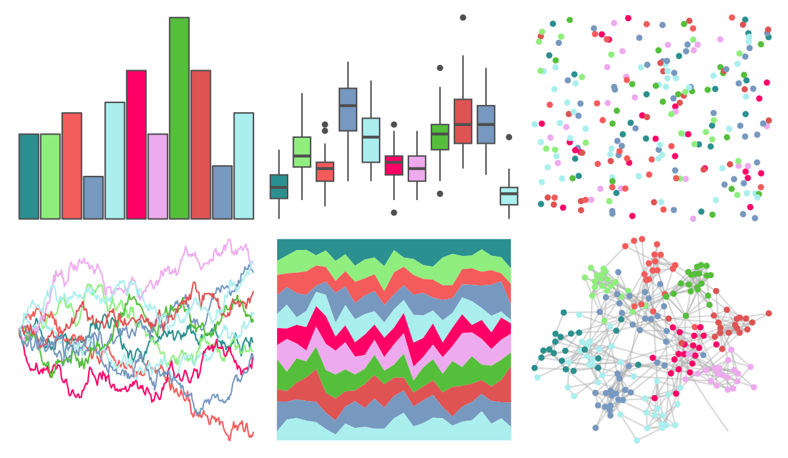

# ggthemes - hc_darkunica 

::: columns
::: {.column width="50%"}

**Github**

[jrnold/ggthemes](https://github.com/jrnold/ggthemes)
:::

::: {.column width="50%"}

**CRAN**

[ggthemes](https://CRAN.R-project.org/package=ggthemes)
:::
:::

<hr> 

Use with [paletteer](https://emilhvitfeldt.github.io/paletteer/) package:

```r
library(paletteer)
paletteer_d("ggthemes::hc_darkunica")
```

Use raw:

```r
c("#2B908FFF", "#90EE7EFF", "#F45B5BFF", "#7798BFFF", "#AAEEEEFF", "#FF0066FF", "#EEAAEEFF", "#55BF3BFF", "#DF5353FF", "#7798BFFF", "#AAEEEEFF")
``` 

 

<br>

# Related Palettes

<div class="list" style="display: grid; grid-template-columns: auto auto auto;"> <figure class="figure">
<a href="../../awtools/a_palette/"> </a>
</figure> <figure class="figure">
<a href="../../ggthemes/hc_default/"> </a>
</figure> <figure class="figure">
<a href="../../basetheme/clean/"> </a>
</figure> <figure class="figure">
<a href="../../basetheme/minimal/"> </a>
</figure> <figure class="figure">
<a href="../../basetheme/void/"> </a>
</figure> <figure class="figure">
<a href="../../palettetown/ralts/"> </a>
</figure> <figure class="figure">
<a href="../../beyonce/X66/"> </a>
</figure> <figure class="figure">
<a href="../../werpals/alice/"> </a>
</figure> <figure class="figure">
<a href="../../miscpalettes/pastel/"> </a>
</figure> <figure class="figure">
<a href="../../IslamicArt/shiraz/"> </a>
</figure> <figure class="figure">
<a href="../../tvthemes/Opal/"> </a>
</figure> <figure class="figure">
<a href="../../basetheme/dark/"> </a>
</figure> 
</div>
