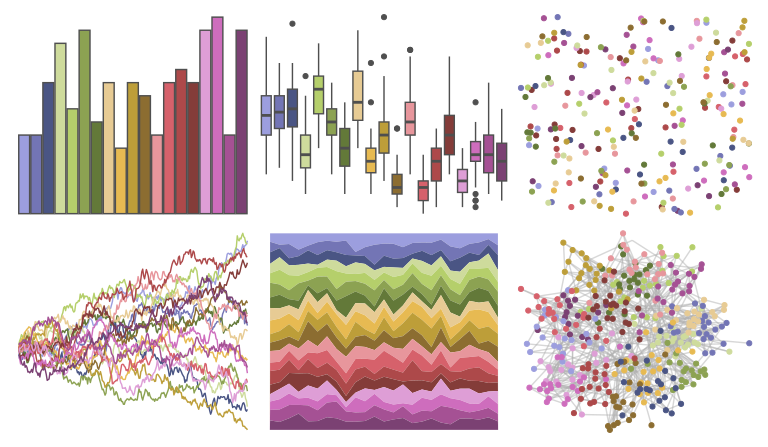

# ggthemes - manyeys 

::: columns
::: {.column width="50%"}

**Github**

[jrnold/ggthemes](https://github.com/jrnold/ggthemes)
:::

::: {.column width="50%"}

**CRAN**

[ggthemes](https://CRAN.R-project.org/package=ggthemes)
:::
:::

<hr> 

Use with [paletteer](https://emilhvitfeldt.github.io/paletteer/) package:

```r
library(paletteer)
paletteer_d("ggthemes::manyeys")
```

Use raw:

```r
c("#9C9EDEFF", "#7375B5FF", "#4A5584FF", "#CEDB9CFF", "#B5CF6BFF", "#8CA252FF", "#637939FF", "#E7CB94FF", "#E7BA52FF", "#BD9E39FF", "#8C6D31FF", "#E7969CFF", "#D6616BFF", "#AD494AFF", "#843C39FF", "#DE9ED6FF", "#CE6DBDFF", "#A55194FF", "#7B4173FF")
``` 

 

<br>

# Related Palettes

<div class="list" style="display: grid; grid-template-columns: auto auto auto;"> <figure class="figure">
<a href="../../awtools/a_palette/"> </a>
</figure> <figure class="figure">
<a href="../../ggsci/category20b_d3/"> </a>
</figure> <figure class="figure">
<a href="../../MetBrewer/Signac/"> </a>
</figure> <figure class="figure">
<a href="../../ggthemes/Hue_Circle/"> </a>
</figure> <figure class="figure">
<a href="../../ggthemes/stata_s2color/"> </a>
</figure> <figure class="figure">
<a href="../../MetBrewer/Redon/"> </a>
</figure> <figure class="figure">
<a href="../../IslamicArt/shiraz2/"> </a>
</figure> <figure class="figure">
<a href="../../impressionist.colors/un_dimanche_apres_midi_a_l_ile_de_la_grande_jatte/"> </a>
</figure> <figure class="figure">
<a href="../../ggthemes/Tableau_20/"> </a>
</figure> <figure class="figure">
<a href="../../DresdenColor/paired/"> </a>
</figure> <figure class="figure">
<a href="../../palettetown/rattata/"> </a>
</figure> <figure class="figure">
<a href="../../rcartocolor/Vivid/"> </a>
</figure> 
</div>
