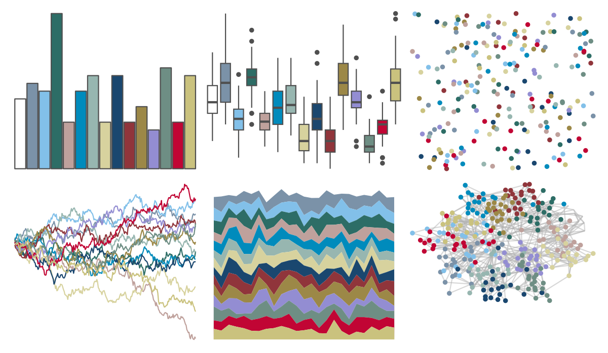
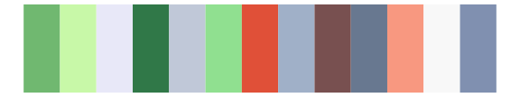

# ggthemes - stata_economist 

::: columns
::: {.column width="50%"}

**Github**

[jrnold/ggthemes](https://github.com/jrnold/ggthemes)
:::

::: {.column width="50%"}

**CRAN**

[ggthemes](https://CRAN.R-project.org/package=ggthemes)
:::
:::

<hr> 

Use with [paletteer](https://emilhvitfeldt.github.io/paletteer/) package:

```r
library(paletteer)
paletteer_d("ggthemes::stata_economist")
```

Use raw:

```r
c("#FFFFFF00", "#7B92A8FF", "#82C0E9FF", "#2D6D66FF", "#BFA19CFF", "#008BBCFF", "#97B6B0FF", "#D7D29EFF", "#1A476FFF", "#90353BFF", "#9C8847FF", "#938DD2FF", "#6E8E84FF", "#C10534FF", "#CAC27EFF")
``` 

 

<br>

# Related Palettes

<div class="list" style="display: grid; grid-template-columns: auto auto auto;"> <figure class="figure">
<a href="../../awtools/a_palette/"> </a>
</figure> <figure class="figure">
<a href="../../palettetown/wartortle/"> </a>
</figure> <figure class="figure">
<a href="../../palettetown/blastoise/"> </a>
</figure> <figure class="figure">
<a href="../../dutchmasters/milkmaid/"> </a>
</figure> <figure class="figure">
<a href="../../palettetown/tentacruel/"> </a>
</figure> <figure class="figure">
<a href="../../palettetown/hitmontop/"> </a>
</figure> <figure class="figure">
<a href="../../palettetown/lapras/"> </a>
</figure> <figure class="figure">
<a href="../../palettetown/chinchou/"> </a>
</figure> <figure class="figure">
<a href="../../palettetown/latios/"> </a>
</figure> <figure class="figure">
<a href="../../palettetown/kirlia/"> </a>
</figure> <figure class="figure">
<a href="../../palettetown/porygon2/"> </a>
</figure> <figure class="figure">
<a href="../../palettetown/butterfree/"> </a>
</figure> 
</div>
