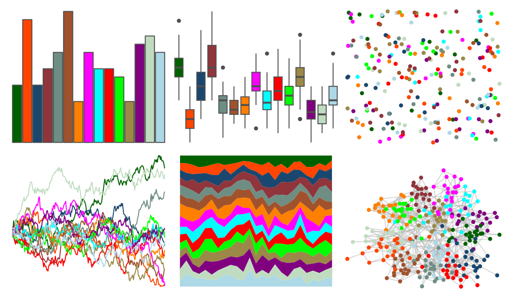

# ggthemes - stata_s1color 

::: columns
::: {.column width="50%"}

**Github**

[jrnold/ggthemes](https://github.com/jrnold/ggthemes)
:::

::: {.column width="50%"}

**CRAN**

[ggthemes](https://CRAN.R-project.org/package=ggthemes)
:::
:::

<hr> 

Use with [paletteer](https://emilhvitfeldt.github.io/paletteer/) package:

```r
library(paletteer)
paletteer_d("ggthemes::stata_s1color")
```

Use raw:

```r
c("#006000FF", "#FF4500FF", "#1A476FFF", "#90353BFF", "#6E8E84FF", "#A0522DFF", "#FF7F00FF", "#FF00FFFF", "#00FFFFFF", "#FF0000FF", "#00FF00FF", "#9C8847FF", "#800080FF", "#C0DCC0FF", "#ADD8E6FF")
``` 

 

<br>

# Related Palettes

<div class="list" style="display: grid; grid-template-columns: auto auto auto;"> <figure class="figure">
<a href="../../amerika/Dem_Ind_Rep3/"> </a>
</figure> <figure class="figure">
<a href="../../miscpalettes/bright/"> </a>
</figure> <figure class="figure">
<a href="../../ggthemes/stata_s1rcolor/"> </a>
</figure> <figure class="figure">
<a href="../../ggsci/schwifty_rickandmorty/"> </a>
</figure> <figure class="figure">
<a href="../../rcartocolor/Vivid/"> </a>
</figure> <figure class="figure">
<a href="../../colorBlindness/paletteMartin/"> </a>
</figure> <figure class="figure">
<a href="../../ggsci/aussie_flatui/"> </a>
</figure> <figure class="figure">
<a href="../../ggthemes/Classic_Cyclic/"> </a>
</figure> <figure class="figure">
<a href="../../ggsci/springfield_simpsons/"> </a>
</figure> <figure class="figure">
<a href="../../basetheme/clean/"> </a>
</figure> <figure class="figure">
<a href="../../basetheme/void/"> </a>
</figure> <figure class="figure">
<a href="../../basetheme/minimal/"> </a>
</figure> 
</div>
