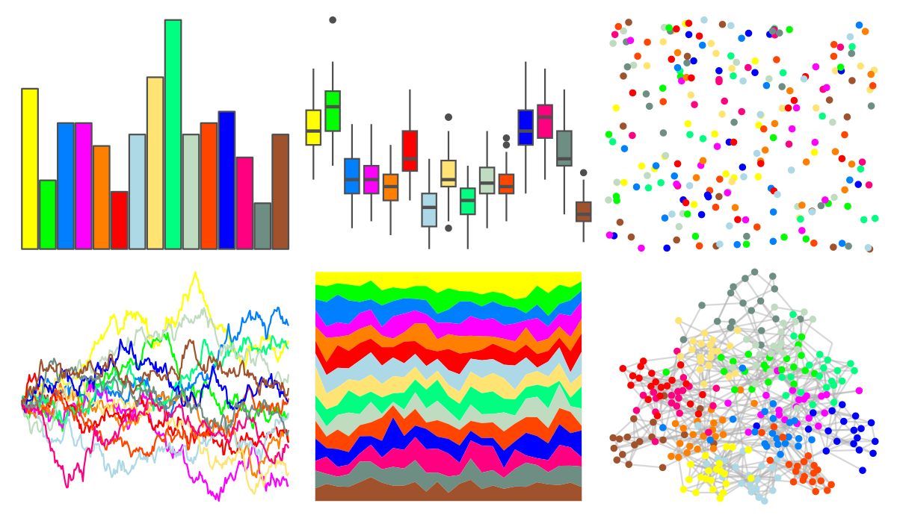
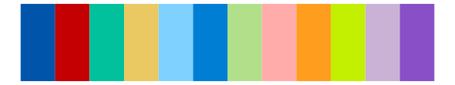

# ggthemes - stata_s1rcolor 

::: columns
::: {.column width="50%"}

**Github**

[jrnold/ggthemes](https://github.com/jrnold/ggthemes)
:::

::: {.column width="50%"}

**CRAN**

[ggthemes](https://CRAN.R-project.org/package=ggthemes)
:::
:::

<hr> 

Use with [paletteer](https://emilhvitfeldt.github.io/paletteer/) package:

```r
library(paletteer)
paletteer_d("ggthemes::stata_s1rcolor")
```

Use raw:

```r
c("#FFFF00FF", "#00FF00FF", "#0080FFFF", "#FF00FFFF", "#FF7F00FF", "#FF0000FF", "#ADD8E6FF", "#FFE474FF", "#00FF80FF", "#C0DCC0FF", "#FF4500FF", "#0000FFFF", "#FF0080FF", "#6E8E84FF", "#A0522DFF")
``` 

 

<br>

# Related Palettes

<div class="list" style="display: grid; grid-template-columns: auto auto auto;"> <figure class="figure">
<a href="../../amerika/Dem_Ind_Rep3/"> </a>
</figure> <figure class="figure">
<a href="../../miscpalettes/bright/"> </a>
</figure> <figure class="figure">
<a href="../../ggthemes/stata_s1color/"> </a>
</figure> <figure class="figure">
<a href="../../miscpalettes/semiTransparent/"> </a>
</figure> <figure class="figure">
<a href="../../tidyquant/tq_dark/"> </a>
</figure> <figure class="figure">
<a href="../../ggprism/stained_glass2/"> </a>
</figure> <figure class="figure">
<a href="../../tidyquant/tq_green/"> </a>
</figure> <figure class="figure">
<a href="../../ggprism/stained_glass/"> </a>
</figure> <figure class="figure">
<a href="../../ggprism/colors/"> </a>
</figure> <figure class="figure">
<a href="../../ggsci/schwifty_rickandmorty/"> </a>
</figure> <figure class="figure">
<a href="../../RColorBrewer/Paired/"> </a>
</figure> <figure class="figure">
<a href="../../miscpalettes/pastel/"> </a>
</figure> 
</div>
