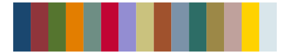
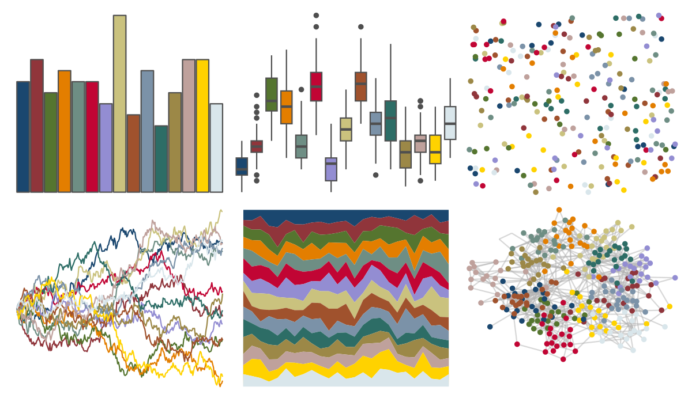

# ggthemes - stata_s2color 

::: columns
::: {.column width="50%"}

**Github**

[jrnold/ggthemes](https://github.com/jrnold/ggthemes)
:::

::: {.column width="50%"}

**CRAN**

[ggthemes](https://CRAN.R-project.org/package=ggthemes)
:::
:::

<hr> 

Use with [paletteer](https://emilhvitfeldt.github.io/paletteer/) package:

```r
library(paletteer)
paletteer_d("ggthemes::stata_s2color")
```

Use raw:

```r
c("#1A476FFF", "#90353BFF", "#55752FFF", "#E37E00FF", "#6E8E84FF", "#C10534FF", "#938DD2FF", "#CAC27EFF", "#A0522DFF", "#7B92A8FF", "#2D6D66FF", "#9C8847FF", "#BFA19CFF", "#FFD200FF", "#D9E6EBFF")
``` 

 

<br>

# Related Palettes

<div class="list" style="display: grid; grid-template-columns: auto auto auto;"> <figure class="figure">
<a href="../../amerika/Dem_Ind_Rep3/"> </a>
</figure> <figure class="figure">
<a href="../../palettetown/sneasel/"> </a>
</figure> <figure class="figure">
<a href="../../palettetown/lanturn/"> </a>
</figure> <figure class="figure">
<a href="../../palettetown/gloom/"> </a>
</figure> <figure class="figure">
<a href="../../palettetown/blastoise/"> </a>
</figure> <figure class="figure">
<a href="../../IslamicArt/shiraz2/"> </a>
</figure> <figure class="figure">
<a href="../../palettetown/lapras/"> </a>
</figure> <figure class="figure">
<a href="../../palettetown/swampert/"> </a>
</figure> <figure class="figure">
<a href="../../dutchmasters/milkmaid/"> </a>
</figure> <figure class="figure">
<a href="../../MetBrewer/Signac/"> </a>
</figure> <figure class="figure">
<a href="../../palettetown/weezing/"> </a>
</figure> <figure class="figure">
<a href="../../palettetown/murkrow/"> </a>
</figure> 
</div>
