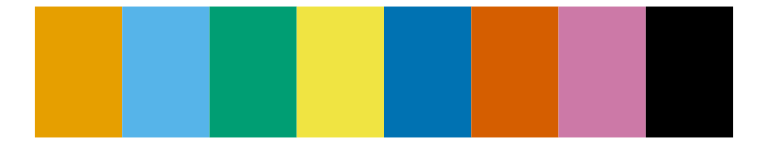

# ggthemes - wsj_colors6 

::: columns
::: {.column width="50%"}

**Github**

[jrnold/ggthemes](https://github.com/jrnold/ggthemes)
:::

::: {.column width="50%"}

**CRAN**

[ggthemes](https://CRAN.R-project.org/package=ggthemes)
:::
:::

<hr> 

Use with [paletteer](https://emilhvitfeldt.github.io/paletteer/) package:

```r
library(paletteer)
paletteer_d("ggthemes::wsj_colors6")
```

Use raw:

```r
c("#C72E29FF", "#016392FF", "#BE9C2EFF", "#098154FF", "#FB832DFF", "#000000FF")
``` 

 

<br>

# Related Palettes

<div class="list" style="display: grid; grid-template-columns: auto auto auto;"> <figure class="figure">
<a href="../../awtools/a_palette/"> </a>
</figure> <figure class="figure">
<a href="../../tvthemes/attackOnTitan/"> </a>
</figure> <figure class="figure">
<a href="../../nbapalettes/celtics2/"> </a>
</figure> <figure class="figure">
<a href="../../fishualize/Centropyge_loricula/"> </a>
</figure> <figure class="figure">
<a href="../../ggsci/default_uchicago/"> </a>
</figure> <figure class="figure">
<a href="../../nbapalettes/suns/"> </a>
</figure> <figure class="figure">
<a href="../../tvthemes/FireNation/"> </a>
</figure> <figure class="figure">
<a href="../../nbapalettes/hawks/"> </a>
</figure> <figure class="figure">
<a href="../../nbapalettes/hawks_90s/"> </a>
</figure> <figure class="figure">
<a href="../../ggsci/dark_uchicago/"> </a>
</figure> <figure class="figure">
<a href="../../tvthemes/Lannister/"> </a>
</figure> <figure class="figure">
<a href="../../colorblindr/OkabeIto_black/"> </a>
</figure> 
</div>
