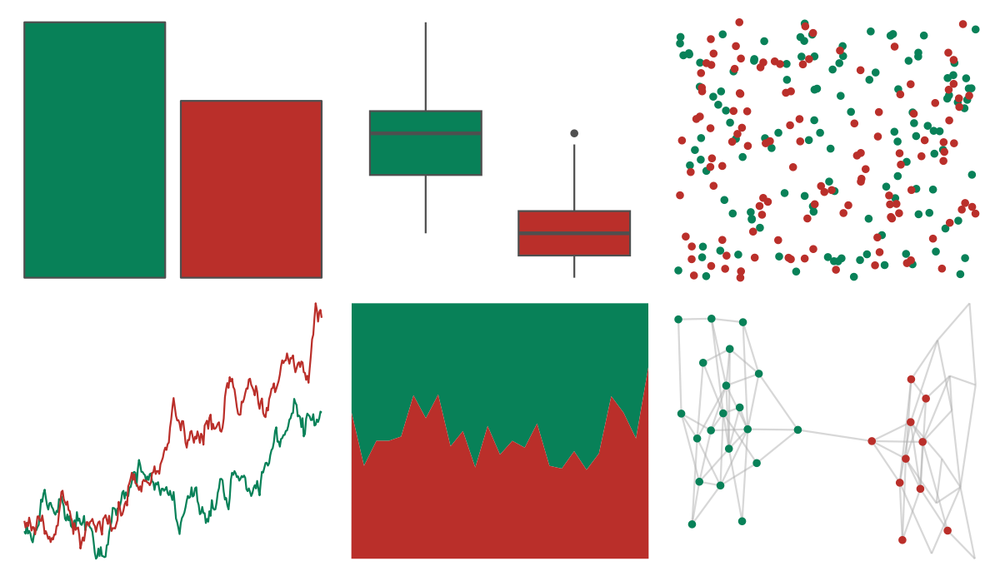

# ggthemes - wsj_red_green 

::: columns
::: {.column width="50%"}

**Github**

[jrnold/ggthemes](https://github.com/jrnold/ggthemes)
:::

::: {.column width="50%"}

**CRAN**

[ggthemes](https://CRAN.R-project.org/package=ggthemes)
:::
:::

<hr> 

Use with [paletteer](https://emilhvitfeldt.github.io/paletteer/) package:

```r
library(paletteer)
paletteer_d("ggthemes::wsj_red_green")
```

Use raw:

```r
c("#088158FF", "#BA2F2AFF")
``` 

 

<br>

# Related Palettes

<div class="list" style="display: grid; grid-template-columns: auto auto auto;"> <figure class="figure">
<a href="../../amerika/Dem_Ind_Rep3/"> </a>
</figure> <figure class="figure">
<a href="../../nbapalettes/pacers_classic/"> </a>
</figure> <figure class="figure">
<a href="../../nbapalettes/pelicans/"> </a>
</figure> <figure class="figure">
<a href="../../nbapalettes/hawks_retro/"> </a>
</figure> <figure class="figure">
<a href="../../futurevisions/atomic_red/"> </a>
</figure> <figure class="figure">
<a href="../../nbapalettes/warriors_city/"> </a>
</figure> <figure class="figure">
<a href="../../ggsci/alternating_igv/"> </a>
</figure> <figure class="figure">
<a href="../../khroma/highcontrast/"> </a>
</figure> <figure class="figure">
<a href="../../nbapalettes/warriors_cny/"> </a>
</figure> <figure class="figure">
<a href="../../nbapalettes/cavaliers_90s/"> </a>
</figure> <figure class="figure">
<a href="../../nbapalettes/bucks_00s/"> </a>
</figure> <figure class="figure">
<a href="../../trekcolors/starfleet/"> </a>
</figure> 
</div>
