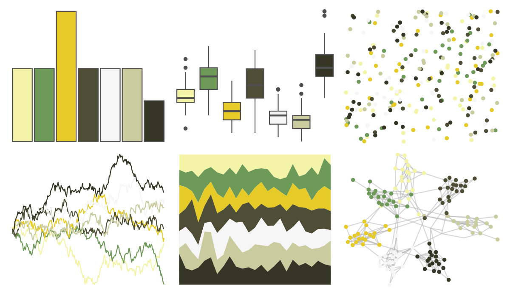

# ggthemr - camouflage 

::: columns
::: {.column width="50%"}

**Github**

[Mikata-Project/ggthemr](https://github.com/Mikata-Project/ggthemr)
:::

::: {.column width="50%"}

**CRAN**

Not on CRAN
:::
:::

<hr> 

Use with [paletteer](https://emilhvitfeldt.github.io/paletteer/) package:

```r
library(paletteer)
paletteer_d("ggthemr::camouflage")
```

Use raw:

```r
c("#F4F4A9FF", "#6D9A58FF", "#E5CA28FF", "#4E4E36FF", "#F6F6F6FF", "#C8CC9FFF", "#353525FF")
``` 

 

<br>

# Related Palettes

<div class="list" style="display: grid; grid-template-columns: auto auto auto;"> <figure class="figure">
<a href="../../awtools/a_palette/"> </a>
</figure> <figure class="figure">
<a href="../../ButterflyColors/hamadryas_feronia/"> </a>
</figure> <figure class="figure">
<a href="../../ButterflyColors/hamadryas_feronia/"> </a>
</figure> <figure class="figure">
<a href="../../wesanderson/Moonrise1/"> </a>
</figure> <figure class="figure">
<a href="../../colRoz/nq_stream/"> </a>
</figure> <figure class="figure">
<a href="../../fishualize/Prognathodes_guyanensis/"> </a>
</figure> <figure class="figure">
<a href="../../nationalparkcolors/Yellowstone/"> </a>
</figure> <figure class="figure">
<a href="../../palettetown/geodude/"> </a>
</figure> <figure class="figure">
<a href="../../palettetown/graveler/"> </a>
</figure> <figure class="figure">
<a href="../../tvthemes/EarthKingdom/"> </a>
</figure> <figure class="figure">
<a href="../../palettetown/electrike/"> </a>
</figure> <figure class="figure">
<a href="../../lisa/SandySkoglund/"> </a>
</figure> 
</div>
